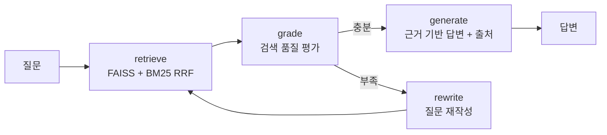
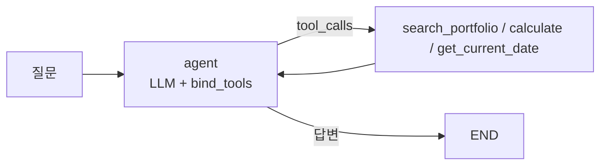
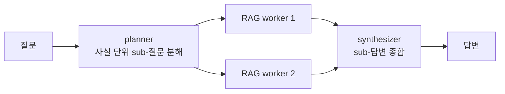
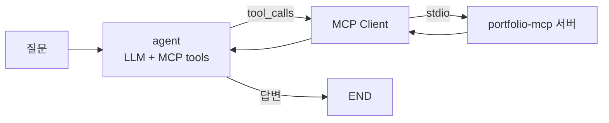

# rag-agent


내 포트폴리오/기술문서를 지식 베이스로 쓰는 로컬 RAG Agent.
LangGraph로 만들었고, 검색 품질을 스스로 평가해서 부족하면 질문을 재작성하는
corrective 루프에, 도구(검색/계산/날짜)를 골라 쓰는 tool-calling 레이어,
멀티홉 질문을 분해 처리하는 multi-agent 오케스트레이션 레이어, 그리고
도구를 MCP 서버에서 가져오는 MCP 클라이언트 레이어를 얹었다.

Ollama + FAISS 조합이라 전부 로컬에서 돌고 외부 API가 필요 없다.

## 구조

```
src/
├── config.py     모델, 청킹, 검색 파라미터
├── ingest.py     문서 → 청킹 → 임베딩 → FAISS + 청크 저장(BM25용)
├── graph.py      Corrective-RAG 그래프 (하이브리드 검색 + self-correction)
├── tools.py      Agent 도구 (검색 / 계산 / 날짜)
├── agent.py      Tool-Calling Agent (ReAct 루프 + 폴백)
├── team.py       Multi-Agent: Planner → RAG Workers → Synthesizer
├── mcp_agent.py  MCP 클라이언트 Agent (portfolio-mcp 서버의 도구 사용)
├── api.py        FastAPI /ask
└── cli.py        대화형 CLI
eval/
├── eval_set.json      평가 질문 10문항 (정답 패턴 포함)
├── evaluate.py        정답률, 재작성률, 지연시간 측정
├── retrieval_set.json 질문별 gold chunk 라벨 (내용 md5로 고정)
├── eval_retrieval.py  검색 단독 recall@k / MRR (LLM 불필요, 수 초)
└── rescore.py         저장된 결과를 새 채점 기준으로 재채점
```

### RAG 흐름



검색은 FAISS(의미)와 BM25(키워드)를 RRF로 섞는다. 'Jenkins'나 'Pyannote' 같은
고유명사 질문에서 벡터 검색이 자꾸 엉뚱한 걸 가져와서 넣었는데, 효과가 컸다.
답변은 문서 근거가 없으면 모른다고 하게 프롬프트를 잡았다.

### Tool-Calling 레이어



RAG 검색을 `search_portfolio` 도구로 감싸고, 계산(`calculate`, AST 기반이라 eval 안 씀)과
날짜 조회를 추가했다. "TTFB가 2292ms에서 334ms로 줄었는데 몇 % 개선이야?" 같은
질문이 들어오면 모델이 알아서 검색과 계산을 조합한다.

```bash
python src/agent.py "TTFB가 2292ms에서 334ms로 줄었는데 몇 퍼센트 개선이야?"
# 사용한 도구: ['calculate'] → 약 85.43% 개선
```

### Multi-Agent 레이어 (멀티홉 질문)

단일 RAG는 "A와 B 중 어느 게 먼저야?" 같은 멀티홉 질문에 약하다 —
한 번의 검색으로 서로 다른 두 사실을 모두 가져오기 어렵기 때문이다.



- planner가 질문을 문서에서 찾을 수 있는 사실 단위의 **의문문**으로 분해
  (최대 3개, JSON 파싱 실패 시 원 질문 단일 처리 폴백)
- 각 sub-질문을 기존 Corrective-RAG가 worker로 처리 — planner가 이미
  질의를 정제했으므로 worker의 자체 재작성은 끈다 (이중 가공 방지)
- sub-질문이 1개면 synthesizer 호출을 생략해 불필요한 LLM 호출 제거

```bash
python src/team.py "TTS 프로젝트와 Kubernetes 프로젝트 중 어느 것을 먼저 시작했어?"
# sub-질문: ["TTS 프로젝트는 언제 시작했어?", "Kubernetes 프로젝트는 언제 시작했어?"]
# → "먼저 시작한 것은 Kubernetes 프로젝트입니다. TTS는 2025년 9월, Kubernetes는 2024년 3월부터..."
```

### MCP 클라이언트 레이어

tool-calling 레이어의 도구는 이 저장소 안에 하드코딩되어 있다.
`mcp_agent.py`는 같은 에이전트 구조에서 도구만 MCP로 바꾼 버전이다 —
별도 저장소인 [portfolio-mcp](https://github.com/ckc5800/portfolio-mcp) 서버를
stdio로 띄우고, 서버가 광고하는 도구 4개(프로필/프로젝트/논문/BM25 검색)를
`langchain-mcp-adapters`로 변환해 에이전트에 물린다.



도구 정의가 에이전트 밖(서버)에 있으니, 서버에 도구가 추가되면 에이전트는
코드 수정 없이 그대로 쓴다. MCP 서버(제공자)와 클라이언트(소비자)를
양쪽 다 만들어 본 것이 포인트. 무응답 폴백 등 소형 모델 대응은
agent.py와 동일한 패턴을 쓴다.

```bash
# 형제 디렉토리에 portfolio-mcp 클론 필요 (경로는 PORTFOLIO_MCP_SERVER로 변경)
python src/mcp_agent.py "우수 논문상을 받은 논문 제목이 뭐야?"
# MCP 서버가 광고한 도구: ['portfolio_search', 'portfolio_list_projects',
#                          'portfolio_get_publications', 'portfolio_get_profile']
# 사용한 도구: ['portfolio_get_publications']
# 답변: 이윤선의 우수 논문상을 수상한 논문 제목은 "국방 데이터 확보를 위한
#       생성모델 Latent Diffusion 실험"입니다. ...
```

3B 모델이 폴백 없이 스스로 `portfolio_get_publications`를 골랐다 —
질문 성격에 맞는 도구 선택까지 MCP 도구 스키마만으로 동작한다.

## 실행

```bash
# Ollama 설치 후 (GPU 있으면 config.py에서 7b로 바꾸는 걸 추천)
ollama pull qwen2.5:3b
ollama pull bge-m3

python -m venv .venv && .venv\Scripts\activate
pip install -r requirements.txt

python src/ingest.py    # 인덱스 구축
python src/cli.py       # RAG로 질문
python src/agent.py "질문"      # tool-calling agent로 질문
python src/team.py "질문"       # multi-agent로 멀티홉 질문
python src/mcp_agent.py "질문"  # MCP 도구를 쓰는 agent (portfolio-mcp 필요)
python eval/evaluate.py         # 단일 RAG 평가 (LLM 필요)
python eval/eval_retrieval.py   # 검색 단독 recall@k (LLM 불필요, 수 초)
python eval/evaluate_team.py    # 멀티홉: 단일 RAG vs 팀 비교
```

## 평가와 삽질 기록

10문항 평가셋으로 정답률 / 재작성률 / 지연시간을 측정한다.
뭔가 바꿀 때마다 돌려서 회귀 여부를 확인하는 용도다.

| | v1 | v2 | v4 | v5* | v6* |
|---|---|---|---|---|---|
| 정답률 | 50% | 60% | 60% | 70% | 70% |
| 재작성률 | 100% | 30% | 30% | 30% | 40% |
| 검색 때문에 틀린 것 | 3건 | 3건 | 1건 | 1건 | 1건 |

*v5부터는 더 엄격한 패턴 채점(아래) 기준이라 앞 열과 직접 비교는 안 된다.
3B 모델의 런 간 편차(±10%p)를 감안하면 60→70은 개선이라기보다 같은 수준.
v6는 검색 개선(아래 4번) 후의 런.

수치보다 과정이 재미있었다. 커밋 로그에 다 남아 있다.

1. 첫 평가에서 재작성률이 100%가 나왔다. 프롬프트 문제인 줄 알고 한참 고쳤는데,
   알고 보니 grade 노드가 반환하는 키가 `AgentState`에 정의돼 있지 않아서
   LangGraph가 값을 조용히 버리고 있었다. 판정 결과와 무관하게 매번 재작성으로
   빠진 것. 스키마에 키 하나 추가로 해결.
2. 그 다음에도 재작성이 남아 있었는데, 'yes/no'로 답하라는 프롬프트에 모델이
   '예/아니오'로 답해서 파싱이 실패하고 있었다. 한국어 응답까지 받게 고쳤다.
3. 고유명사 질문('Jenkins', 'Pyannote')은 벡터 검색이 계속 놓쳤다. BM25를 섞은
   하이브리드로 바꾸고 나서 검색 기인 실패가 3건에서 1건으로 줄었다.
4. RRF 중복 제거 키를 청크 앞 100자로 잡았다가, 같은 접두어로 시작하는 청크들이
   합쳐지는 문제를 코드 리뷰에서 발견. 전체 내용 해시로 바꿨다.
5. 시스템 프롬프트를 길게 쓰면 3B 모델의 tool calling이 아예 죽는다는 걸
   실험으로 확인했다. 프롬프트를 최소로 줄이고, 그래도 무응답이면 검색을
   강제 호출하는 폴백을 넣었다.
6. 멀티홉 답변이 같은 코드로 됐다 안 됐다 했다. temperature 0.1의 미세한
   샘플링 차이 때문이었는데, 원인 추적이 불가능해서 먼저 temperature를 0으로
   고정해 재현 가능하게 만든 뒤 통제 실험으로 변수를 하나씩 분리했다.
7. 그렇게 찾은 원인이 두 개였다. 하나는 planner가 정제한 sub-질문을 worker가
   또 재작성해서 검색 믹스를 흐트러뜨리는 것 — 팀 경로에서는 재작성을 껐다.
   다른 하나는 3B 모델이 엄격한 거부 지시와 명사형 질문("~의 시작 기간")
   조합에서 답을 거부하는 것 — 같은 내용을 의문문("언제 시작했어?")으로 물으면
   통과한다. planner가 의문문으로 분해하도록 few-shot을 고치고 거부 지시를
   완화해서 해결했다. "(2025.09~)" 같은 압축 날짜 표기를 기간으로 해석하지
   못하는 문제도 표기법 힌트 한 줄로 풀었다.

남은 오답은 대부분 3B 모델의 답변 편차다. 같은 질문도 돌릴 때마다 결과가
±10%p쯤 흔들린다. 모델을 키우면 나아질 영역.

### 검색과 생성을 분리해서 재기

정답률 하나로는 실패가 검색 탓인지 생성 탓인지 알 수 없었다.
그래서 평가를 둘로 쪼갰다.

**1. 검색 단독 평가** (`eval/eval_retrieval.py`) — 질문별로 정답이 담긴
청크를 라벨링해 두고(`retrieval_set.json`, 청크 내용 md5로 고정),
프로덕션과 같은 hybrid_search가 그걸 top-k에 올리는지만 잰다.
LLM이 없어서 결정적이고, 수 초 만에 끝난다.

| recall@1 | recall@3 | recall@6 | MRR |
|---:|---:|---:|---:|
| 70% | 90% | 90% | 0.767 |

10문항 중 9개는 gold가 3위 안에 온다. 유일한 MISS가 "근무한 회사들"
질문 — 회사 목록이 모여 있는 청크가 top-6에 아예 못 든다. 이 질문의
실패는 생성이 아니라 검색 문제라는 게 처음으로 분리돼 보였다.

**2. 채점을 엄격하게** (`eval/rescore.py`) — 키워드 포함 채점은
"논문 7편"의 '7'이 다른 숫자에 우연히 들어가도 통과시킨다. 단위까지
요구하는 정규식 패턴(`7\s*편`)에 전부 일치해야 하고, 거부 답변은
무조건 실패로 바꿨다. 저장된 이전 결과를 재채점해 보니 뒤집힌 케이스는
없었다(6/10 유지) — 이번 런의 통과는 진짜였고, 채점만 단단해진 것.

**3. 전체 재평가 (v5)** — 엄격한 채점으로 70%(7/10). 틀린 3건을 분해하면
1건은 검색 실패(회사 목록, 위에서 확인), 2건은 gold가 1위로 검색됐는데도
생성이 놓친 것 — 3B 모델의 답변 편차 영역이다. 실패 원인이
"검색 1 + 생성 2"로 딱 떨어지는 것 자체가 분리 측정의 소득이다.
다음 개선이 각각 어디를 겨냥해야 하는지(회사 목록 질문은 청킹,
나머지는 모델 크기)가 지표에서 바로 읽힌다.

**4. 검색 실패를 고쳤다** — 원인이 두 개였다. 경력 요약이 담긴 About Me
청크가 노션 내보내기의 `$\color{...}$` 장식으로 오염되어 임베딩이 흐려져
있었고, BM25의 공백 토큰화가 '회사들'(질의)과 '회사'(문서)를 다른 토큰으로
취급했다. 인제스트에 마크다운 정제를 넣고 BM25에 한글 문자 bigram
토크나이저를 붙여 재인제스트한 결과:

| | 전 | 후 |
|---|---:|---:|
| recall@1 | 70% | 80% |
| recall@6 | 90% | 100% |
| MRR | 0.767 | 0.875 |

회사 목록 질문은 MISS(top-6 밖)에서 rank 4로 올라왔다. 청크 경계가
바뀌어 gold 라벨은 같은 기준으로 재라벨링했다.

다만 rank 4로는 아직 부족하다 — generate는 lost-in-the-middle 대응으로
**top-3만 쓰기 때문에**(삽질 6번), 검색엔 잡혀도 생성기에는 전달되지
않는다. 실제로 개선 후 전체 재평가(v6)에서도 이 질문은 여전히 거부로
실패했고, 정답률은 70%로 v5와 같았다(실패 구성만 이동: 검색 순위 1건 +
생성 2건 — 논문 편수를 4편으로 잘못 세는 집계 실패와 CI/CD 도구 열거
누락은 3B 편차 영역). recall@6 100%보다 recall@3이 실효 지표라는 것도
이번에 확인한 것. 다음 후보: 경력 요약 전용 청크를 만들어 rank를
끌어올리거나, generate 컨텍스트를 top-4로 늘려 lost-in-the-middle과의
트레이드오프를 재실험.

### 멀티홉 비교 평가에서 배운 것

멀티홉 3문항으로 단일 RAG와 팀을 비교했다 (`eval/evaluate_team.py`).
수치보다 실패 패턴이 흥미로웠다.

- 단일 RAG는 사실 수집 단계부터 무너진다 — "TTS는 2022년부터 시작"처럼
  없는 사실을 지어내거나 아예 못 찾는다.
- 팀은 sub-사실 수집은 정확했다 (두 프로젝트의 기간을 모두 정답으로 가져옴).
  하지만 synthesizer 단계에서 3B 모델의 **비교·집계 추론**이 흔들린다 —
  "2024.03과 2025.09 중 무엇이 먼저인가"를 실행에 따라 맞히기도 틀리기도 하고,
  청크에 흩어진 논문 편수를 세는 것도 실패한다.
- 키워드 채점은 이런 '근거는 맞는데 결론이 틀린' 답을 잡지 못한다는 것도
  확인했다 (양쪽 다 false-pass 발생). LLM-judge나 결론 필드 구조화가 필요하다.

정리하면: planner-worker 구조는 **검색·수집 문제를 풀었고**, 남은 병목은
소형 모델의 산술·비교 추론이다. 날짜/수량 비교를 모델에 맡기지 않고
결정적 코드로 처리하거나 모델을 키우면 해결될 영역이다.

## 한계

- BM25의 조사 문제는 문자 bigram 토크나이저로 완화했지만 형태소 분석기
  대비 정밀도는 떨어진다. 회사 목록 질문도 rank 4까지만 올라온다 —
  요약형 질문에 강한 요약 청크를 따로 두는 것이 다음 후보.
- 개발 PC(i7-4790 + RTX 2070)에서 Ollama의 GPU 백엔드(ggml-cuda)가 초기화 중
  크래시(0xC0000005)가 나서 CPU로 추론 중이다. DLL 로드와 드라이버는 정상이고
  백엔드 초기화 단계에서 죽는 것까지 재현해서 확인했다.
  [ollama#16957](https://github.com/ollama/ollama/issues/16957)과 같은 증상.

## 스택

LangGraph / Qwen2.5-3B (Ollama) / BGE-M3 / FAISS + BM25 / FastAPI
