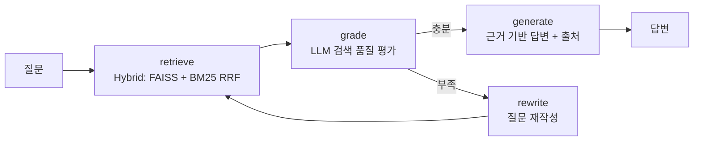

# Portfolio RAG Agent

LangGraph 기반 **Corrective-RAG Q&A Agent** — 개인 포트폴리오/기술문서를 지식 베이스로,
검색 품질을 스스로 평가하고 질문을 재작성하는 self-corrective 루프를 갖춘 로컬 RAG 시스템입니다.

전부 로컬에서 동작합니다 (Ollama + ChromaDB, 외부 API 불필요).

## Architecture



- **Hybrid Retrieval**: FAISS(의미 검색) + BM25(키워드 검색)를 RRF(Reciprocal Rank Fusion)로 융합 — 고유명사/키워드 질문에서 벡터 검색이 놓치는 문서를 보완
- **State Management**: LangGraph `StateGraph`로 질문/검색 질의/문서/재작성 횟수를 상태로 관리
- **Self-Correction**: 검색 결과가 부족하면 LLM이 질문을 키워드 중심으로 재작성해 재검색
- **Grounded Generation**: 문서에 없는 내용은 답변하지 않도록 프롬프트 설계 (hallucination 억제)
- **Evaluation Loop**: 키워드 기반 정답률 + 재작성률 + 지연시간을 측정하는 평가 셋 내장

## Tech Stack

| 구성 | 기술 |
|---|---|
| Agent Framework | LangGraph |
| LLM | Qwen2.5-7B (Ollama, 로컬) |
| Embedding | BGE-M3 (Ollama, 다국어) |
| Vector DB | ChromaDB |
| Serving | FastAPI |

## Quickstart

```bash
# 0. Ollama 설치 후 모델 준비
ollama pull qwen2.5:7b
ollama pull bge-m3

# 1. 의존성 설치
python -m venv .venv && .venv\Scripts\activate
pip install -r requirements.txt

# 2. 문서 인제스트 (data/docs/*.md → ChromaDB)
python src/ingest.py

# 3-a. CLI로 질문
python src/cli.py

# 3-b. API 서버
uvicorn api:app --app-dir src --port 8000
curl -X POST localhost:8000/ask -H "Content-Type: application/json" -d "{\"question\": \"TTS 프로젝트의 TTFB 개선 수치는?\"}"

# 4. 평가 실행
python eval/evaluate.py
```

## Evaluation

`eval/eval_set.json`의 10개 질문으로 성능을 측정합니다:

- **Answer Accuracy** — 기대 키워드가 답변에 포함되는 비율
- **Rewrite Rate** — self-correction 루프 발동 비율 (검색 품질 지표)
- **Latency** — 질문당 응답 시간

### 평가 루프로 개선한 실측 기록

| 지표 | v1 (baseline) | v2 (state 버그 수정) | v4 (하이브리드 검색) |
|---|---|---|---|
| Answer Accuracy | 50% | 60% | **60%** (검색 실패 해소) |
| Rewrite Rate | 100% | 30% | **30%** |
| 검색 기인 실패 | 3건 | 3건 | **1건** |

평가 루프에서 발견한 이상 신호를 추적해 실제 결함을 찾아 수정한 과정 (git 히스토리 참조):

1. **State 스키마 버그** — grade 노드의 판정 결과가 `AgentState`에 정의되지 않은
   키로 반환되어 LangGraph가 값을 폐기 → 판정과 무관하게 항상 재작성 발생 (재작성률 100% 신호로 발견)
2. **판정 파싱 버그** — 'yes/no' 요구 프롬프트에 한국어 모델이 '예/아니오'로
   응답하면 파싱 실패 → 한국어 응답을 포함한 견고한 파싱으로 수정
3. **키워드 질문 검색 실패** — 'Jenkins', 'Pyannote' 같은 고유명사 질문에서 벡터 검색이
   관련 청크를 놓침 → BM25 + FAISS 하이브리드 검색(RRF 직접 구현)으로 해소
4. **RRF 중복 제거 키 충돌** — 코드 리뷰에서 발견, 접두어 기반 키를 전체 내용 해시로 교체

남은 실패는 소형 모델(3B)의 답변 편차가 주 원인으로, 동일 질문도 런마다 pass/fail이
변동합니다 (±10%p). 모델 업그레이드로 개선 가능한 영역입니다.

### 알려진 한계

- **BM25 한국어 토큰화** — 공백 단위 분리라 조사가 붙은 어절의 매칭이 약함 (형태소 분석기 도입 여지)
- **CPU 추론 지연** — 개발 환경(i7-4790 + RTX 2070)에서 Ollama의 GPU 백엔드(ggml-cuda)가
  초기화 시 크래시(0xC0000005)해 CPU로 추론. DLL 로드/드라이버는 정상이며 백엔드 초기화
  단계 크래시임을 직접 재현으로 확인 — [ollama#16957](https://github.com/ollama/ollama/issues/16957)과 동일 증상.
  GPU 환경에서는 `config.py`의 `LLM_MODEL`을 `qwen2.5:7b`로 변경 권장
