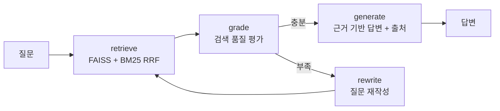
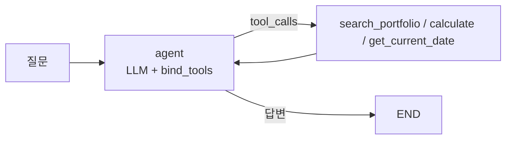

# rag-agent

내 포트폴리오/기술문서를 지식 베이스로 쓰는 로컬 RAG Agent.
LangGraph로 만들었고, 검색 품질을 스스로 평가해서 부족하면 질문을 재작성하는
corrective 루프에, 도구(검색/계산/날짜)를 골라 쓰는 tool-calling 레이어를 얹었다.

Ollama + FAISS 조합이라 전부 로컬에서 돌고 외부 API가 필요 없다.

## 구조

```
src/
├── config.py     모델, 청킹, 검색 파라미터
├── ingest.py     문서 → 청킹 → 임베딩 → FAISS + 청크 저장(BM25용)
├── graph.py      Corrective-RAG 그래프 (하이브리드 검색 + self-correction)
├── tools.py      Agent 도구 (검색 / 계산 / 날짜)
├── agent.py      Tool-Calling Agent (ReAct 루프 + 폴백)
├── api.py        FastAPI /ask
└── cli.py        대화형 CLI
eval/
├── eval_set.json 평가 질문 10문항
└── evaluate.py   정답률, 재작성률, 지연시간 측정
```

### RAG 흐름



검색은 FAISS(의미)와 BM25(키워드)를 RRF로 섞는다. 'Jenkins'나 'Pyannote' 같은
고유명사 질문에서 벡터 검색이 자꾸 엉뚱한 걸 가져와서 넣었는데, 효과가 컸다.
답변은 문서 근거가 없으면 모른다고 하게 프롬프트를 잡았다.

### Tool-Calling 레이어



RAG 검색을 `search_portfolio` 도구로 감싸고, 계산(`calculate`, AST 기반이라 eval 안 씀)과
날짜 조회를 추가했다. "TTFB가 2292ms에서 334ms로 줄었는데 몇 % 개선이야?" 같은
질문이 들어오면 모델이 알아서 검색과 계산을 조합한다.

```bash
python src/agent.py "TTFB가 2292ms에서 334ms로 줄었는데 몇 퍼센트 개선이야?"
# 사용한 도구: ['calculate'] → 약 85.43% 개선
```

## 실행

```bash
# Ollama 설치 후 (GPU 있으면 config.py에서 7b로 바꾸는 걸 추천)
ollama pull qwen2.5:3b
ollama pull bge-m3

python -m venv .venv && .venv\Scripts\activate
pip install -r requirements.txt

python src/ingest.py    # 인덱스 구축
python src/cli.py       # RAG로 질문
python src/agent.py "질문"   # tool-calling agent로 질문
python eval/evaluate.py # 평가
```

## 평가와 삽질 기록

10문항 평가셋으로 정답률 / 재작성률 / 지연시간을 측정한다.
뭔가 바꿀 때마다 돌려서 회귀 여부를 확인하는 용도다.

| | v1 | v2 | v4 |
|---|---|---|---|
| 정답률 | 50% | 60% | 60% |
| 재작성률 | 100% | 30% | 30% |
| 검색 때문에 틀린 것 | 3건 | 3건 | 1건 |

수치보다 과정이 재미있었다. 커밋 로그에 다 남아 있다.

1. 첫 평가에서 재작성률이 100%가 나왔다. 프롬프트 문제인 줄 알고 한참 고쳤는데,
   알고 보니 grade 노드가 반환하는 키가 `AgentState`에 정의돼 있지 않아서
   LangGraph가 값을 조용히 버리고 있었다. 판정 결과와 무관하게 매번 재작성으로
   빠진 것. 스키마에 키 하나 추가로 해결.
2. 그 다음에도 재작성이 남아 있었는데, 'yes/no'로 답하라는 프롬프트에 모델이
   '예/아니오'로 답해서 파싱이 실패하고 있었다. 한국어 응답까지 받게 고쳤다.
3. 고유명사 질문('Jenkins', 'Pyannote')은 벡터 검색이 계속 놓쳤다. BM25를 섞은
   하이브리드로 바꾸고 나서 검색 기인 실패가 3건에서 1건으로 줄었다.
4. RRF 중복 제거 키를 청크 앞 100자로 잡았다가, 같은 접두어로 시작하는 청크들이
   합쳐지는 문제를 코드 리뷰에서 발견. 전체 내용 해시로 바꿨다.
5. 시스템 프롬프트를 길게 쓰면 3B 모델의 tool calling이 아예 죽는다는 걸
   실험으로 확인했다. 프롬프트를 최소로 줄이고, 그래도 무응답이면 검색을
   강제 호출하는 폴백을 넣었다.

남은 오답은 대부분 3B 모델의 답변 편차다. 같은 질문도 돌릴 때마다 결과가
±10%p쯤 흔들린다. 모델을 키우면 나아질 영역.

## 한계

- BM25 토큰화가 공백 단위라 조사 붙은 한국어 어절에 약하다. 형태소 분석기를
  붙이면 나아질 것.
- 개발 PC(i7-4790 + RTX 2070)에서 Ollama의 GPU 백엔드(ggml-cuda)가 초기화 중
  크래시(0xC0000005)가 나서 CPU로 추론 중이다. DLL 로드와 드라이버는 정상이고
  백엔드 초기화 단계에서 죽는 것까지 재현해서 확인했다.
  [ollama#16957](https://github.com/ollama/ollama/issues/16957)과 같은 증상.

## 스택

LangGraph / Qwen2.5-3B (Ollama) / BGE-M3 / FAISS + BM25 / FastAPI
