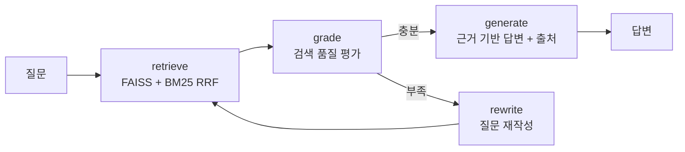
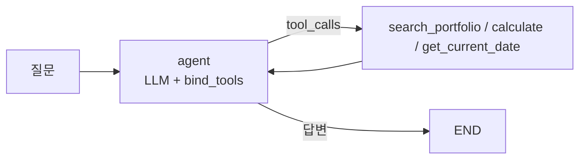
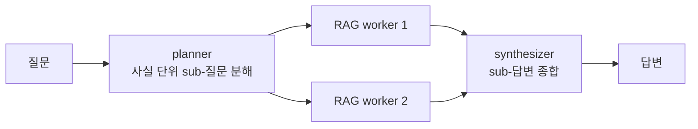
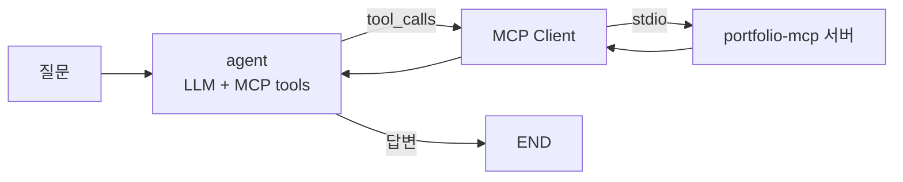

# rag-agent


내 포트폴리오/기술문서를 지식 베이스로 쓰는 로컬 RAG Agent.
LangGraph로 만들었고, 검색 품질을 스스로 평가해서 부족하면 질문을 재작성하는
corrective 루프에, 도구(검색/계산/날짜)를 골라 쓰는 tool-calling 레이어,
멀티홉 질문을 분해 처리하는 multi-agent 오케스트레이션 레이어, 그리고
도구를 MCP 서버에서 가져오는 MCP 클라이언트 레이어를 얹었다.

Ollama + FAISS 조합이라 전부 로컬에서 돌고 외부 API가 필요 없다.

## 구조

```
src/
├── config.py     모델, 청킹, 검색 파라미터 (측정 근거를 주석으로 남김)
├── preflight.py  기동 전 점검 — 인덱스·Ollama·모델 보유 확인
├── runmeta.py    실행 환경 지문 (결과 파일에 붙여 비교 가능성 확보)
├── inspect_data.py  인덱싱 전 데이터 검수 (길이 분포 + 잔여 노이즈 스캔)
├── vectorstore.py   벡터 저장소 교체 레이어 (FAISS / Qdrant)
├── ingest.py     문서 → 정제 → 청킹 → 임베딩 → 벡터 저장소 + 청크 저장(BM25용)
├── loaders.py    비마크다운 코퍼스 포맷 — PDF/DOCX/HWPX 텍스트 추출 (아래 참고)
├── graph.py      Corrective-RAG 그래프 (하이브리드 검색 + self-correction + 리랭크)
├── route.py      질문 유형별 컨텍스트 전략 라우팅 (실험, 기본 꺼둠)
├── cache.py      응답 캐시 — api.py 서빙 경계 전용 (설정 지문으로 A/B 오염 방지)
├── tracelog.py   실사용 질의 트레이스 (JSONL, api.py·cli.py 경계 전용)
├── tools.py      Agent 도구 (검색 / 계산 / 날짜)
├── agent.py      Tool-Calling Agent (ReAct 루프 + 폴백)
├── team.py       Multi-Agent: Planner → RAG Workers → Synthesizer
├── mcp_agent.py  MCP 클라이언트 Agent (portfolio-mcp 서버의 도구 사용)
├── api.py        FastAPI /ask, /ask/stream(SSE 토큰 스트리밍), /health
├── cli.py        대화형 CLI
├── ingest_parent_child.py  Parent-Child 청킹 인제스트 (실험, 별도 인덱스)
├── graph_parent_child.py   Parent-Child RAG 그래프 (실험 — 현재 base 대비 이점 없음, 아래 참고)
├── semantic_chunk.py       시맨틱 청킹 핵심 로직 (임베딩 유사도 breakpoint, 순수 함수)
├── ingest_semantic.py      시맨틱 청킹 인제스트 (실험, 별도 인덱스 — 현재 base보다 recall 낮음)
├── ingest_alt_embed.py     대안 임베딩 모델 인제스트 (실험, 미실행 — 모델 다운로드 필요)
├── kg.py                   Graph RAG — 트리플 추출·그래프 검색·RRF 융합 (실험, 아래 참고)
├── ingest_kg.py            지식 그래프 구축 (LLM로 청크마다 트리플 추출)
├── klue_re.py              KLUE-RE 2차 코퍼스 — 청크·정답 그래프·평가질문 생성 (실험, 아래 참고)
└── ingest_klue.py          KLUE-RE 인덱스 구축 (하이브리드 + 정답 그래프, LLM 불필요)
eval/
├── eval_set.json      평가 질문 51문항 (유형별 + 거부 10 · 패턴/앵커)
├── evaluate.py        정답률, 재작성률, 지연시간 측정
├── retrieval_set.json 질문별 gold chunk 라벨 (내용 md5로 고정)
├── eval_retrieval.py  검색 단독 recall@k / MRR (LLM 불필요, 수 초)
├── eval_grade.py      grade 판정기 단독 평가 (gold에서 라벨 유도 + 상수 기준선)
├── evaluate_team.py   멀티홉: 단일 RAG vs 팀 비교
├── diagnose.py        실패 원인 분해 — 검색/청킹/생성 층 분리 (LLM 불필요)
├── sweep_top_k.py     TOP_K 스윕 (검색 후보 수, LLM 불필요)
├── ab_rewrite.py      corrective 루프 A/B (MAX_REWRITES 0 vs 1, 10문항)
├── ab_rewrite_stratified.py  corrective 루프 A/B — 유형별 2문항 층화 표본(51문항 축소판)
├── ab_type_routing.py TYPE_ROUTING A/B (aggregation·enumeration만 대상)
├── ab_top_n.py        generate 컨텍스트 개수 스윕 (top-3/4/5/6)
├── ab_neighbor_window.py  NEIGHBOR_WINDOW A/B 반복 재측정
├── ab_context_order.py    CONTEXT_ORDER A/B 반복 재측정 (reversed/ranked/sandwich)
├── ab_rerank.py           RERANK A/B (첫 실측)
├── ab_prompt_variant.py   GENERATE_PROMPT_VARIANT A/B (base vs targeted)
├── ab_route_variants.py   route.ROUTES 오버라이드 조합 A/B (라우팅 내용 자체)
├── audit_patterns.py  채점 패턴 감사 (정답을 오답으로 집계하는지 검사)
├── audit_docs.py      README-코드 일치 확인 (CI에서 실행)
├── eval_tool_chain.py 도구 체이닝 한계 측정 (모델을 바꿔가며 1→2→3단)
├── compare_stores.py  FAISS vs Qdrant — 결과 일치 확인 + 필터 비교
├── sweep_chunk_size.py 청크 크기 300~1600 스윕 (앵커 기반 gold, 기준선 포함)
├── relabel_retrieval.py 청킹이 바뀌었을 때 gold 라벨 재부착 (매칭 점수 출력)
├── audit_gold.py      gold 라벨 누락 감사 (정답 표현으로 전 청크 스캔)
├── rescore.py         저장된 결과를 새 채점 기준으로 재채점
├── compare_parent_child.py    base vs parent-child recall·생성 비교
├── experiment_paper_count.py  parent-child 실패 원인 분리 실험(모델 크기 vs 프롬프트)
├── repeat_parent_child.py     base vs parent-child 반복 검증 (grade→rewrite 루프 포함)
├── compare_semantic.py        base vs 시맨틱 청킹 recall 비교 (앵커 기반 gold)
├── compare_embeddings.py      bge-m3 vs 대안 임베딩 recall 비교 (앵커 기반 gold)
├── eval_kg_retrieval.py       hybrid vs 그래프 단독 vs RRF 융합 recall@k/MRR (LLM 불필요)
├── eval_klue_retrieval.py     KLUE-RE 2차 코퍼스에서 같은 3종 비교 (LLM 불필요)
├── sweep_seed_match_ratio.py  Graph RAG 시드 판정 임계값 스윕 (KLUE-RE, LLM 불필요)
└── sweep_rrf_k.py             RRF 완충 상수 스윕 (LLM 불필요)
```

### RAG 흐름



검색은 FAISS(의미)와 BM25(키워드)를 RRF로 섞는다. 'Jenkins'나 'Pyannote' 같은
고유명사 질문에서 벡터 검색이 자꾸 엉뚱한 걸 가져와서 넣었는데, 효과가 컸다.
답변은 문서 근거가 없으면 모른다고 하게 프롬프트를 잡았다.

### Tool-Calling 레이어



RAG 검색을 `search_portfolio` 도구로 감싸고, 계산(`calculate`, AST 기반이라 eval 안 씀)과
날짜 조회를 추가했다. "TTFB가 2292ms에서 334ms로 줄었는데 몇 % 개선이야?" 같은
질문이 들어오면 모델이 알아서 검색과 계산을 조합한다.

```bash
python src/agent.py "TTFB가 2292ms에서 334ms로 줄었는데 몇 퍼센트 개선이야?"
# 사용한 도구: ['calculate'] → 약 85.43% 개선
```

### Multi-Agent 레이어 (멀티홉 질문)

단일 RAG는 "A와 B 중 어느 게 먼저야?" 같은 멀티홉 질문에 약하다 —
한 번의 검색으로 서로 다른 두 사실을 모두 가져오기 어렵기 때문이다.



- planner가 질문을 문서에서 찾을 수 있는 사실 단위의 **의문문**으로 분해
  (최대 3개, JSON 파싱 실패 시 원 질문 단일 처리 폴백)
- 각 sub-질문을 기존 Corrective-RAG가 worker로 처리 — planner가 이미
  질의를 정제했으므로 worker의 자체 재작성은 끈다 (이중 가공 방지)
- sub-질문이 1개면 synthesizer 호출을 생략해 불필요한 LLM 호출 제거

```bash
python src/team.py "TTS 프로젝트와 Kubernetes 프로젝트 중 어느 것을 먼저 시작했어?"
# sub-질문: ["TTS 프로젝트는 언제 시작했어?", "Kubernetes 프로젝트는 언제 시작했어?"]
# → "먼저 시작한 것은 Kubernetes 프로젝트입니다. TTS는 2025년 9월, Kubernetes는 2024년 3월부터..."
```

### MCP 클라이언트 레이어

tool-calling 레이어의 도구는 이 저장소 안에 하드코딩되어 있다.
`mcp_agent.py`는 같은 에이전트 구조에서 도구만 MCP로 바꾼 버전이다 —
별도 저장소인 [portfolio-mcp](https://github.com/ckc5800/portfolio-mcp) 서버를
stdio로 띄우고, 서버가 광고하는 도구 4개(프로필/프로젝트/논문/BM25 검색)를
`langchain-mcp-adapters`로 변환해 에이전트에 물린다.



도구 정의가 에이전트 밖(서버)에 있으니, 서버에 도구가 추가되면 에이전트는
코드 수정 없이 그대로 쓴다. MCP 서버(제공자)와 클라이언트(소비자)를
양쪽 다 만들어 본 것이 포인트. 무응답 폴백 등 소형 모델 대응은
agent.py와 동일한 패턴을 쓴다.

```bash
# 형제 디렉토리에 portfolio-mcp 클론 필요 (경로는 PORTFOLIO_MCP_SERVER로 변경)
python src/mcp_agent.py "우수 논문상을 받은 논문 제목이 뭐야?"
# MCP 서버가 광고한 도구: ['portfolio_search', 'portfolio_list_projects',
#                          'portfolio_get_publications', 'portfolio_get_profile']
# 사용한 도구: ['portfolio_get_publications']
# 답변: 이윤선의 우수 논문상을 수상한 논문 제목은 "국방 데이터 확보를 위한
#       생성모델 Latent Diffusion 실험"입니다. ...
```

3B 모델이 폴백 없이 스스로 `portfolio_get_publications`를 골랐다 —
질문 성격에 맞는 도구 선택까지 MCP 도구 스키마만으로 동작한다.

## 실행

```bash
# Ollama 설치 후 (GPU 있으면 config.py에서 7b로 바꾸는 걸 추천)
ollama pull qwen2.5:3b
ollama pull bge-m3

python -m venv .venv && .venv\Scripts\activate
pip install -r requirements.txt

python src/inspect_data.py   # 0단계: 인덱싱할 텍스트를 눈으로 확인 (LLM 불필요)
python src/ingest.py    # 인덱스 구축 (VECTOR_STORE=qdrant 로 저장소 교체 가능)
python src/cli.py       # RAG로 질문
python src/agent.py "질문"      # tool-calling agent로 질문
python src/team.py "질문"       # multi-agent로 멀티홉 질문
python src/mcp_agent.py "질문"  # MCP 도구를 쓰는 agent (portfolio-mcp 필요)
python eval/evaluate.py         # 단일 RAG 평가 (LLM 필요)
python eval/eval_retrieval.py   # 검색 단독 recall@k (LLM 불필요, 수 초)
python eval/eval_grade.py       # grade 판정기 단독 평가 (정확도·오탐·파싱실패)
python src/preflight.py         # 인덱스·Ollama·모델 사전 점검
python eval/diagnose.py         # 실패 원인 분해: 검색/청킹/생성 (LLM 불필요)
python eval/sweep_top_k.py      # TOP_K 스윕 (LLM 불필요)
python eval/audit_patterns.py --strict   # 채점 패턴 감사 (CI에서도 실행)
python eval/audit_docs.py       # README-코드 일치 확인 (CI에서도 실행)
python eval/ab_rewrite.py       # corrective 루프가 값을 하는지 A/B (수십 분)
python eval/ab_top_n.py --values 3 4 5 6 # generate 컨텍스트 개수 스윕
python eval/evaluate_team.py    # 멀티홉: 단일 RAG vs 팀 비교

# 정제/청킹을 바꾸면 gold 라벨(md5)이 무효화된다 → 재부착
git show HEAD:data/chunks.jsonl > /tmp/old.jsonl
python eval/relabel_retrieval.py --old /tmp/old.jsonl          # 매칭 점수 확인
python eval/relabel_retrieval.py --old /tmp/old.jsonl --write  # 반영
```

## 평가와 삽질 기록

평가셋으로 정답률 / 재작성률 / 지연시간을 측정한다. 뭔가 바꿀 때마다 돌려서
회귀 여부를 확인하는 용도다. 아래 v1~v7은 **10문항 시절의 기록**이고, 이후
51문항으로 확장하면서 일부 결론이 뒤집혔다 —
[평가셋 확장 및 실패 원인 분석](#평가셋-확장-및-실패-원인-분석-측정-보고).

| | v1 | v2 | v4 | v5* | v6* | v7* |
|---|---|---|---|---|---|---|
| 정답률 | 50% | 60% | 60% | 70% | 70% | **90%** |
| 재작성률 | 100% | 30% | 30% | 30% | 40% | 30% |
| 검색 때문에 틀린 것 | 3건 | 3건 | 1건 | 1건 | 1건 | **0건** |

*v5부터는 더 엄격한 패턴 채점(아래) 기준이라 앞 열과 직접 비교는 안 된다.
3B 모델의 런 간 편차(±10%p)를 감안하면 60→70은 개선이라기보다 같은 수준.
v6는 검색 개선(아래 4번) 후의 런. v7은 데이터 검수(아래) 후의 런.

v7의 90%도 10문항 중 9개라 그 숫자 자체를 자랑할 생각은 없다. 의미 있는 건
**검색 기인 실패가 0건이 됐다**는 쪽이다. 남은 실패 1건은 CI/CD 도구 열거인데,
gold 청크가 **rank 1로 검색됐는데도** 모델이 "GitLab CI/CD와 Jenkins"라고
답해 ArgoCD를 빠뜨렸다 — 검색이 아니라 생성의 문제이고, 검색/생성을 분리해
재기 때문에 그 구분이 지표에서 바로 읽힌다.

수치보다 과정이 재미있었다. 커밋 로그에 다 남아 있다.

1. 첫 평가에서 재작성률이 100%가 나왔다. 프롬프트 문제인 줄 알고 한참 고쳤는데,
   알고 보니 grade 노드가 반환하는 키가 `AgentState`에 정의돼 있지 않아서
   LangGraph가 값을 조용히 버리고 있었다. 판정 결과와 무관하게 매번 재작성으로
   빠진 것. 스키마에 키 하나 추가로 해결.
2. 그 다음에도 재작성이 남아 있었는데, 'yes/no'로 답하라는 프롬프트에 모델이
   '예/아니오'로 답해서 파싱이 실패하고 있었다. 한국어 응답까지 받게 고쳤다.
3. 고유명사 질문('Jenkins', 'Pyannote')은 벡터 검색이 계속 놓쳤다. BM25를 섞은
   하이브리드로 바꾸고 나서 검색 기인 실패가 3건에서 1건으로 줄었다.
4. RRF 중복 제거 키를 청크 앞 100자로 잡았다가, 같은 접두어로 시작하는 청크들이
   합쳐지는 문제를 코드 리뷰에서 발견. 전체 내용 해시로 바꿨다.
5. 시스템 프롬프트를 길게 쓰면 3B 모델의 tool calling이 아예 죽는다는 걸
   실험으로 확인했다. 프롬프트를 최소로 줄이고, 그래도 무응답이면 검색을
   강제 호출하는 폴백을 넣었다.
6. 멀티홉 답변이 같은 코드로 됐다 안 됐다 했다. temperature 0.1의 미세한
   샘플링 차이 때문이었는데, 원인 추적이 불가능해서 먼저 temperature를 0으로
   고정해 재현 가능하게 만든 뒤 통제 실험으로 변수를 하나씩 분리했다.
7. 그렇게 찾은 원인이 두 개였다. 하나는 planner가 정제한 sub-질문을 worker가
   또 재작성해서 검색 믹스를 흐트러뜨리는 것 — 팀 경로에서는 재작성을 껐다.
   다른 하나는 3B 모델이 엄격한 거부 지시와 명사형 질문("~의 시작 기간")
   조합에서 답을 거부하는 것 — 같은 내용을 의문문("언제 시작했어?")으로 물으면
   통과한다. planner가 의문문으로 분해하도록 few-shot을 고치고 거부 지시를
   완화해서 해결했다. "(2025.09~)" 같은 압축 날짜 표기를 기간으로 해석하지
   못하는 문제도 표기법 힌트 한 줄로 풀었다.

남은 오답은 대부분 3B 모델의 답변 편차다. 같은 질문도 돌릴 때마다 결과가
±10%p쯤 흔들린다. 모델을 키우면 나아질 영역.

### 검색과 생성을 분리해서 재기

정답률 하나로는 실패가 검색 탓인지 생성 탓인지 알 수 없었다.
그래서 평가를 둘로 쪼갰다.

**1. 검색 단독 평가** (`eval/eval_retrieval.py`) — 질문별로 정답이 담긴
청크를 라벨링해 두고(`retrieval_set.json`, 청크 내용 md5로 고정),
프로덕션과 같은 hybrid_search가 그걸 top-k에 올리는지만 잰다.
LLM이 없어서 결정적이고, 수 초 만에 끝난다.

<details>
<summary><b>gold 청크를 어떻게 정했나</b> (이 평가에서 가장 판단이 들어간 부분)</summary>

**손으로 붙였다.** 라벨링 스크립트는 없다. 질문 10개에 gold 총 23개,
**질문당 1~4개**다.

**기준은 하나 — "그 청크만 보고 질문에 정확히 답할 수 있는가."**
키워드 포함이 아니다. 실제로 키워드는 있는데 gold에서 뺀 것들이 있다:

| 청크 | 질문 | 왜 뺐나 |
|---|---|---|
| `"논문 2편 게재(제1저자)"` | 논문 몇 편? | `제1저자`는 있지만 **특정 연구의 2편**이다. 이걸 근거로 답하면 **"2편"이라는 오답**이 나온다 |
| `"학술 성과: … 우수논문상"` | 우수논문상 받은 **논문 제목**은? | 수상 사실만 있고 **제목이 없다** |
| `"동시 처리 채널 확장 및 안정성 확보"` | **몇 개로** 확장? | **숫자가 없다** (게다가 STT 프로젝트 얘기) |

반대로 문서가 어디든 상관없다. 같은 사실이 여러 곳에 있으면 전부 gold다 —
특허 번호는 `patents.md`의 표, `resume.md`의 논문 목록, `portfolio.md`의
프로젝트 상세에 모두 나오고 셋 다 답이 된다.

질문 하나에 정답 청크가 여러 개인 이유는 **같은 사실이 여러 문서에 중복**되기
때문이다. TTFB 수치는 `portfolio.md`(원본 로그)와 `resume.md`(이력서 요약)
양쪽에 있다. 그래서 "이 청크만 정답"이 아니라 **"gold 중 하나라도 top-k에
오면 성공"**으로 정의했다. 단일 정답 가정을 버린 것이다.

라벨은 **청크 내용의 md5**라서, 청킹을 바꾸면 자동으로 무효화된다. 옛 라벨로
새 인덱스를 채점하는 사고를 구조적으로 막았다(바꾼 뒤엔 `relabel_retrieval.py`
로 다시 붙인다).

**이 방식의 약점 둘과 대응:**

1. **누락** — 편향보다 이게 먼저 온다. 손으로 35청크짜리 문서를 훑다 보면
   **답이 있는데 빠뜨린다.** 실제로 `portfolio.md`에 `10-2538225-0000`이
   명시돼 있는데 특허 질문의 gold에서 빠져 있었다. 누락은 **recall을 실제보다
   낮게** 만든다(정답이 상위에 와도 오답 처리되므로).

   그래서 `eval/audit_gold.py`를 만들었다. 질문별 정답 표현으로 전 청크를
   훑어 **gold 밖 후보를 뽑되, 자동으로 넣지는 않는다** — 문자열이 있다고 답이
   되는 게 아니기 때문이다. 후보 4건 중 **진짜 누락은 1건**이었고 나머지 3건은
   위 표의 "키워드는 있으나 답이 아닌" 경우였다. 판단은 사람이 한다.

2. **자기 라벨링** — 시스템을 만든 사람이 라벨을 붙였으니 "검색기가 가져온 걸
   정답이라고 표시한 것 아니냐"는 순환 위험이 있다. 그래서 **gold 전부가 실제
   정답 문자열을 담고 있는지 역검증**했다 — TTFB 질문의 gold 4개가 모두
   `2292`와 `334`를 포함한다.

3. **gold가 많으면 우연히 맞기 쉽다** — 그래서 **무작위 기준선을 계산**했다.
   67청크에서 6개를 뽑을 때 질문별 gold 수(1~4개)를 반영하면,
   **무작위 검색기의 기대 recall@6은 19%**다. 현재 시스템은 100%.
   기준선 없는 지표는 혼자서 아무것도 증명하지 못한다.

남는 한계는 **제3자 라벨링이 아니고 10문항**이라는 것이다. 실무라면 쿼리
로그에서 유형별로 뽑고 클릭·구매 같은 약한 라벨을 섞어 규모를 키우는 게 맞다.

</details>

| recall@1 | recall@3 | recall@6 | MRR |
|---:|---:|---:|---:|
| 70% | 90% | 90% | 0.767 |

10문항 중 9개는 gold가 3위 안에 온다. 유일한 MISS가 "근무한 회사들"
질문 — 회사 목록이 모여 있는 청크가 top-6에 아예 못 든다. 이 질문의
실패는 생성이 아니라 검색 문제라는 게 처음으로 분리돼 보였다.

**2. 채점을 엄격하게** (`eval/rescore.py`) — 키워드 포함 채점은
"논문 7편"의 '7'이 다른 숫자에 우연히 들어가도 통과시킨다. 단위까지
요구하는 정규식 패턴(`7\s*편`)에 전부 일치해야 하고, 거부 답변은
무조건 실패로 바꿨다. 저장된 이전 결과를 재채점해 보니 뒤집힌 케이스는
없었다(6/10 유지) — 이번 런의 통과는 진짜였고, 채점만 단단해진 것.

**3. 전체 재평가 (v5)** — 엄격한 채점으로 70%(7/10). 틀린 3건을 분해하면
1건은 검색 실패(회사 목록, 위에서 확인), 2건은 gold가 1위로 검색됐는데도
생성이 놓친 것 — 3B 모델의 답변 편차 영역이다. 실패 원인이
"검색 1 + 생성 2"로 딱 떨어지는 것 자체가 분리 측정의 소득이다.
다음 개선이 각각 어디를 겨냥해야 하는지(회사 목록 질문은 청킹,
나머지는 모델 크기)가 지표에서 바로 읽힌다.

**4. 검색 실패를 고쳤다** — 원인이 두 개였다. 경력 요약이 담긴 About Me
청크가 노션 내보내기의 `$\color{...}$` 장식으로 오염되어 임베딩이 흐려져
있었고, BM25의 공백 토큰화가 '회사들'(질의)과 '회사'(문서)를 다른 토큰으로
취급했다. 인제스트에 마크다운 정제를 넣고 BM25에 한글 문자 bigram
토크나이저를 붙여 재인제스트한 결과:

| | 전 | 후 |
|---|---:|---:|
| recall@1 | 70% | 80% |
| recall@6 | 90% | 100% |
| MRR | 0.767 | 0.875 |

회사 목록 질문은 MISS(top-6 밖)에서 rank 4로 올라왔다. 청크 경계가
바뀌어 gold 라벨은 같은 기준으로 재라벨링했다.

다만 rank 4로는 아직 부족하다 — generate는 lost-in-the-middle 대응으로
**top-3만 쓰기 때문에**(삽질 6번), 검색엔 잡혀도 생성기에는 전달되지
않는다. 실제로 개선 후 전체 재평가(v6)에서도 이 질문은 여전히 거부로
실패했고, 정답률은 70%로 v5와 같았다(실패 구성만 이동: 검색 순위 1건 +
생성 2건 — 논문 편수를 4편으로 잘못 세는 집계 실패와 CI/CD 도구 열거
누락은 3B 편차 영역). recall@6 100%보다 recall@3이 실효 지표라는 것도
이번에 확인한 것. 다음 후보: 경력 요약 전용 청크를 만들어 rank를
끌어올리거나, generate 컨텍스트를 top-4로 늘려 lost-in-the-middle과의
트레이드오프를 재실험.

### 순서를 잘못 밟았다 — 데이터 검수를 뒤늦게 만든 이야기

위의 "임베딩 오염"을 고치고 나서야 이상한 걸 깨달았다. **정제가 파이프라인의
마지막에 들어와 있었다.** 초기 커밋에는 정제 코드가 아예 없었고,
`clean_markdown`은 일주일 뒤 마지막 커밋에 추가됐다. 그것도 검색/생성 분리
평가가 MISS를 짚어준 뒤에야.

변명하자면 "어떤 노이즈가 해로울지 미리 알 수 없다"고 할 수 있다. 그건
절반만 맞다. 내가 놓친 건 노이즈를 **예측**하는 일이 아니라 인덱싱할 텍스트를
**한 번 눈으로 보는** 일이었다. 청크를 몇 개만 출력해 봤으면 5분이면 보였다.

그래서 그 5분을 강제하는 스크립트를 만들었다 (`src/inspect_data.py`).
길이 분포, 가장 짧은 청크, 잔여 노이즈 패턴을 찍는다. 돌려 보니 **이미
고쳤다고 생각한 데이터에 노이즈가 더 남아 있었다**:

| 발견 | 청크 | 글자 | 코퍼스 대비 |
|---|---:|---:|---:|
| 노션 내부 링크(퍼센트 인코딩 경로) | 13 | 4,073자 | **9.4%** |
| HTML 태그 (`<aside>`, ``) | 5 | 674자 | 1.6% |

노션은 내부 페이지 링크를 `[Experience](%EC%9D%B4%EC%9C%A4%EC%84%A0%20...)`
처럼 인코딩된 한글 파일명으로 내보낸다. 링크 **텍스트**는 의미가 있지만
경로는 순수 노이즈인데, 그것만으로 인덱싱 대상의 9.4%를 먹고 있었다.

고치면서 걸린 함정 둘:

1. **외부 URL도 인코딩을 쓴다.** 논문 링크(`...articleTitle=GAN%EC%9D%84+...`)를
   같이 지우면 "깃허브 주소" 같은 질문에 답할 수 없게 된다. 그래서 단순 치환이
   아니라 `http(s)://`로 시작하는 타깃은 보존하도록 함수로 판별한다.
2. **중첩 링크.** `[[A](url)(kisti) ](내부경로)`는 바깥 텍스트에 `]`가 있어
   링크 정규식이 못 잡는다. 짝을 잃고 남은 `](경로)` 조각을 지우는 규칙을 더했다.

또 `'---'`(3자), `'# 이윤선 이력서'`(9자) 같은 조각이 인덱스 자리만 차지하고
있어 `MIN_CHUNK_CHARS = 30` 필터를 넣었다. 전체 글자의 0.2%라 성능에는 영향이
없지만, 평균 청크 길이를 546자로 끌어내려 **분포를 오해하게 만들고 있었다**
(중앙값은 694자였다).

결과 — 청크 79개 → 67개, 중앙값 694 → 711자:

| | 검수 전 | 검수 후 |
|---|---:|---:|
| recall@1 | 80% | **90%** |
| recall@3 | 90% | **100%** |
| recall@6 | 100% | 100% |
| MRR | 0.875 | **0.95** |

recall@1의 10%p는 10문항 중 1문항이라 그 자체로는 통계적 의미가 없다.
의미 있는 건 **"근무한 회사들" 질문이 rank 4 → rank 2로 올라온 것**이다.
`generate`는 lost-in-the-middle 대응으로 top-3만 쓰기 때문에 rank 4는 애초에
생성기에 전달조차 안 됐다. 문턱을 넘은 것이라 성격이 다르다.

실제로 전체 평가(v7)에서 **이 질문이 처음으로 통과했다.** 프로젝트 시작부터
계속 실패하던 유일한 검색 기인 실패였다:

```
PASS  이윤선이 근무한 회사들을 알려주세요.
  → AICESS (2025.04~재직중) / 인피닉 (2022.08~2025.04) /
    이든티앤에스 (2022.04~2022.08) / 큐헷지 (2020.09~2021.09)
```

정답률은 70% → **90%**, 검색 기인 실패는 **1건 → 0건**이 됐다.

> 이 결론은 10문항 기준이다. 51문항으로 확장 후 recall@3이 83%로 하락했다.
> [평가셋 확장 및 실패 원인 분석](#평가셋-확장-및-실패-원인-분석-측정-보고) 참조.

마지막으로 두 가지를 구조로 남겼다. `inspect_data.py --strict`를 **CI에 걸어**
정제가 놓친 노이즈가 있으면 빌드가 실패하게 했고(임베딩·LLM이 필요 없어 몇 초면
끝난다), 청킹이 바뀌면 md5 라벨이 무효화되므로 이전 청크와 대조해 gold를 다시
붙이는 `eval/relabel_retrieval.py`를 만들었다. 자동 매칭이 조용히 틀리면 평가가
통째로 거짓이 되므로 **매칭 점수를 전부 출력하고 임계 미만이면 반영을 거부**한다.

한 가지는 일부러 안 고쳤다. mermaid 다이어그램 3청크는 문법(`graph`,
`subgraph`, 화살표)이 노이즈지만 노드 라벨은 실제 기술 키워드다. 지우면
키워드까지 잃는다. 검수기는 이걸 "결함"이 아니라 **"판단 필요"**로 분류해
보고만 하고 통과시킨다 — 검수기의 역할은 후보를 찾아 주는 것이지 대신
판단하는 것이 아니다.

### 도구 체이닝은 어디서 깨지나

`agent.py`는 구조적으로 multi-step(agent → tools → agent)이다. 하지만
"구조가 지원한다"와 "이 모델이 해낸다"는 다르다. 필요한 도구 수를 늘려가며
**각 3회** 재봤다 (`eval/eval_tool_chain.py`, 성공 횟수 · 중앙값):

| 단계 | qwen2.5:3b | qwen2.5:7b |
|---|---|---|
| 1단 계산만 | **3/3** · 13s | **3/3** · 22s |
| 2단 검색→계산 | **0/3** · 72s | **3/3** · 197s |
| 3단 검색→날짜→계산 | **0/3** · 16s | **0/3** · 19s |

2단에서 갈린다. 3B는 검색 결과를 받고 "이제 계산하겠습니다"라고 **말만 하고**
tool call을 안 내서 `tools_condition`이 END로 보낸다 — 버그가 아니라 모델이
주문서 대신 소감문을 낸 것이다. 3단은 둘 다 `get_current_date`만 부르고
입사일 검색을 건너뛴다. 그리고 7B의 2단은 1단보다 **9배 느리다**(22s→197s).

**측정 방법에서 틀렸던 것** — 처음엔 셀당 1회로 재고 결론을 냈다. 다음 1회에서
3B가 성공하길래 "내가 틀렸다"고 철회했는데, 3회씩 재보니 그 1회가 이상치였고
원래 결론이 맞았다. n=1은 양방향으로 위험하다 — 잘못 확신하게도, 맞는 결론을
잘못 철회하게도 만든다.

3단 실패를 **모델 탓으로 단정하지는 않는다.** 도구 설명에 "입사일·재직 기간"이
없고, 질문의 "올해 기준으로"가 날짜 도구를 먼저 부르게 유도하며, 도구 결과 후
"더 필요한가"를 묻는 장치가 없다. 셋 다 내 코드다.

### FAISS와 Qdrant를 둘 다 붙여봤다

"왜 FAISS인가"에 답하려면 다른 걸 써봐야 했다. `VECTOR_STORE` 환경변수로
교체되게 하고(`src/vectorstore.py`), 같은 평가를 양쪽에 돌렸다.
Qdrant는 서버 없이 로컬 경로로 띄우는 임베디드 모드를 썼다.

```bash
VECTOR_STORE=qdrant python src/ingest.py
VECTOR_STORE=qdrant python eval/eval_retrieval.py
python eval/compare_stores.py     # 둘을 나란히 비교
```

**검색 결과는 완전히 같았다.** recall@1 90% / @3 100% / MRR 0.95, 10문항의
순위까지 한 문항도 다르지 않다. 같은 임베딩에 같은 exact 검색이니 당연하고,
**달랐다면 어딘가 틀린 것**이다.

차이는 **메타데이터 필터**에서 나온다. FAISS는 필터를 못 받아 넉넉히 뽑아
파이썬에서 걸러야 하는데, "몇 배로 뽑을지"를 정할 근거가 없다.
`"이윤선이 근무한 회사들"` 질의에 source 필터를 걸어 재봤다:

| 조건 (전체 67청크 중) | 1배(6개) | 2배(12) | 5배(30) | 10배(60) | Qdrant |
|---|---|---|---|---|---|
| `resume.md` (8개) | 1/6 | 4/6 | 6/6 | 6/6 | **6/6** |
| `publications.md` (3개) | 0/3 | 0/3 | 1/3 | 3/3 | **3/3** |
| `patents.md` (1개) | 0/1 | 0/1 | 0/1 | 1/1 | **1/1** |

조건이 좁을수록 FAISS는 거의 전수를 뽑아야 한다. 67청크라 60개를 뽑는 게
가능한 것이고, **코퍼스가 커지면 그 방식이 성립하지 않는다.** Qdrant는 필터를
검색 단계에 넣으므로 배수라는 개념 자체가 없다.

정리하면 — **이 규모에서는 FAISS로 충분하고**(파일 2개, 의존성 하나, 서버 없음),
가격·재고처럼 **선택적인 필터가 필요해지는 순간 Qdrant가 맞다.** 로드는 FAISS가
조금 빨랐고(1.0s vs 2.1s) 검색 속도는 사실상 같았다(0.34s vs 0.36s).

### 평균 594자가 커 보인다는 지적 — 원인은 다이어그램이었다

산문만 보면 청크 평균이 545자로 정상 범위인데, 전체 평균은 594자였다.
그 차이를 추적하니 `portfolio.md`의 **ASCII 아키텍처 다이어그램**
(```` ```markdown ```` 펜스 안의 박스 그림)이 원인이었다. 코퍼스의 25%를
차지했고, 800자 텍스트 스플리터가 다이어그램 도중에 상한을 그어 박스가
반토막 나는 청크가 있었다(예: 파이프라인이 `text_processor.py ← ITN`
줄에서 끊김). 다이어그램은 문장 단위가 없는 콘텐츠라 **문자 기준 분할이
애초에 안 맞는 케이스**였다.

`src/ingest.py`의 `extract_diagrams()`가 인덱싱 전에 다이어그램 펜스를
본문에서 떼어내 각각 하나의 통짜 청크로 만든다. 박스 그림 문자
(`┌┐└┘│─┼┬┴` 등) 밀도가 5%를 넘는 펜스만 다이어그램으로 판정하고, API
경로 예시(```` ```POST /api/... ``` ````)처럼 짧고 검색 가치가 있는 펜스는
본문에 그대로 둔다.

```
전: 67청크 — 산문 평균 594자 (다이어그램이 섞여 부풀려짐)
후: 51청크 — 산문 48개(평균 512자) + 다이어그램 3개(4,395~5,079자, 상한 미적용)
```

정답 청크(gold)에 다이어그램이 하나도 안 걸려 있어서 recall·정답률은
그대로다(recall@1 90%, 정답률 90%). **수치가 안 바뀐 게 실패가 아니다** —
이 결함은 애초에 gold가 못 보는 지점이었고, 그래서 지금 평가셋만으로는
검증이 안 된다는 뜻이기도 하다.

### 청크 크기를 스윕해봤다

800자는 튜닝한 값이 아니라 합리적인 기본값이었다. 실제로 재본 적이 없어서
300~1600자로 바꿔가며 검색 성능을 측정했다 (`eval/sweep_chunk_size.py`).

문제가 하나 있었다 — gold 라벨이 청크 md5라 크기를 바꾸면 전부 무효화된다.
그래서 이 스윕만은 **크기와 무관한 정답 앵커 문자열**로 gold를 정의했다
(예: TTFB 질문 → `"2292"`, 회사 목록 → `"Experience Overview"`).
앵커는 각각 현재 인덱스에서 1~4청크에만 등장하도록 좁게 골랐다.

| 크기 | 청크수 | 중앙값 | recall@1 | recall@3 | recall@6 | MRR |
|---:|---:|---:|---|---|---|---:|
| 300 | 170 | 239 | 70% (기준선 2%) | **100%** (5%) | 100% (10%) | 0.833 |
| 500 | 103 | 440 | 60% (3%) | **100%** (7%) | 100% (14%) | 0.783 |
| 800 | 67 | 711 | 90% (4%) | **100%** (11%) | 100% (21%) | 0.950 |
| 1200 | 46 | 1007 | 90% (5%) | **100%** (15%) | 100% (28%) | 0.933 |
| 1600 | 37 | 1490 | 100% (6%) | **100%** (19%) | 100% (34%) | 1.000 |

**recall@3이 전 구간 100%다.** `generate`가 top-3만 쓰므로, 생성기에
전달되는 범위에서는 **이 코퍼스에서 청크 크기가 병목이 아니다.** top-3 밖으로
밀린 질문도 어느 크기에서든 0건이었다.

> recall 수치는 10문항 기준이며 51문항에서는 83%다. 다만 "청크 크기가 병목이
> 아니다"라는 결론은 유지된다 — 51문항 진단에서도 근거 손실 문항은 0건이었다.

recall@1은 클수록 좋아 보이지만 그대로 믿으면 안 된다. 청크가 커지면 개수가
줄어 **무작위 기준선이 2%에서 6%로 올라간다**(top-6 기준으로는 10%→34%).
그리고 10문항이라 60~100%는 **1~4문항 차이**다.

무엇보다 **이건 검색만 잰 것**이다. 1600자 청크 3개를 프롬프트에 넣으면
4,500자가 되어 lost-in-the-middle과 3B의 컨텍스트 한계에 걸린다.
**검색은 잘게 자를수록, 생성은 크게 자를수록 유리해서 방향이 반대다.**
하나의 크기로 둘 다 잡는 대신 parent-child(작은 청크로 검색, 부모 청크로
생성)로 가는 게 맞다는 근거가 됐다.

### 멀티홉 비교 평가에서 배운 것

멀티홉 3문항으로 단일 RAG와 팀을 비교했다 (`eval/evaluate_team.py`).
수치보다 실패 패턴이 흥미로웠다.

- 단일 RAG는 사실 수집 단계부터 무너진다 — "TTS는 2022년부터 시작"처럼
  없는 사실을 지어내거나 아예 못 찾는다.
- 팀은 sub-사실 수집은 정확했다 (두 프로젝트의 기간을 모두 정답으로 가져옴).
  하지만 synthesizer 단계에서 3B 모델의 **비교·집계 추론**이 흔들린다 —
  "2024.03과 2025.09 중 무엇이 먼저인가"를 실행에 따라 맞히기도 틀리기도 하고,
  청크에 흩어진 논문 편수를 세는 것도 실패한다.
- 키워드 채점은 이런 '근거는 맞는데 결론이 틀린' 답을 잡지 못한다는 것도
  확인했다 (양쪽 다 false-pass 발생). LLM-judge나 결론 필드 구조화가 필요하다.

정리하면: planner-worker 구조는 **검색·수집 문제를 풀었고**, 남은 병목은
소형 모델의 산술·비교 추론이다. 날짜/수량 비교를 모델에 맡기지 않고
결정적 코드로 처리하거나 모델을 키우면 해결될 영역이다.

## 평가셋 확장 및 실패 원인 분석 (측정 보고)

위 기록은 모두 10문항 평가셋 기준이다. 51문항으로 확장한 뒤 재측정한 결과와,
그 과정에서 드러난 결함을 정리한다.

측정 환경: qwen2.5:3b / bge-m3 / RTX 5080. 위쪽 측정(CPU 폴백)과 **지연 수치는
비교 불가**하며, 정확도·recall은 하드웨어와 무관하다.

### 1. 평가셋 확장 (10 → 51문항)

10문항에서는 1문항이 10%p이므로, 정답률 90%의 95% 신뢰구간이 약 60~98%다.
개선 여부를 판정할 해상도가 없어 51문항으로 확장하고 유형을 부여했다.

| 유형 | fact | enumeration | aggregation | temporal | comparison | trap | refusal |
|---|---:|---:|---:|---:|---:|---:|---:|
| 문항 수 | 19 | 8 | 6 | 4 | 2 | 2 | 10 |

주요 변경 두 가지.

- **거부 문항 10개 추가.** 기존 `is_pass()`는 거부 답변("찾을 수 없습니다")을
  무조건 오답으로 처리했다. 따라서 코퍼스에 답이 없는 질문을 평가셋에 넣을 수
  없었고, **환각을 측정하는 지표가 존재하지 않았다.** `expect_refusal`
  플래그를 추가해 해당 케이스만 채점을 반전시켰다.
- **gold를 앵커 문자열로 지정.** 신규 문항은 md5 대신 청크 크기 스윕에서 쓰던
  앵커 방식을 적용했다. 재청킹 시 무효화되지 않고 수작업 라벨링이 불필요하다.

비교 문항은 설계를 수정했다. "인피닉과 이든티앤에스 중 어디에 더 오래
근무했나요?" 형태는 두 회사명이 답변에 모두 등장하므로 **오답도 패턴을
통과한다**(멀티홉 평가에서 지적한 false-pass와 동일). "더 오래 근무한 회사의
근무 기간은?"으로 바꿔 결론을 구별 가능한 값으로 답하게 했다.

### 2. 채점기 결함 — 정답 4건을 오답으로 집계

51문항 실행 결과 67%. 실패 답변을 검토한 결과 4건이 정답이었다. 4건 모두
모델이 사용한 표현이 **원본 문서에 실재하는 표기**였다.

| 문항 | 모델 답변 | 기존 패턴 |
|---|---|---|
| 팝 노이즈 | 잉여 버퍼 | `Residual Buffer` (문서: 영문 4회, 한글 1회) |
| 웹소켓 | `pwd_changed_at` | `password_changed_at` (문서: 각 3회, 1회) |
| AICESS 입사일 | 2025년 **04**월 | `4월` (앞자리 0 미고려) |
| 레퍼런스 음성 | 24**,**000 Hz | `24000` (천단위 콤마 미고려) |

거부 판정 정규식도 좁았다. "정보는 전혀 포함되어 있지 않습니다"를 거부로
인식하지 못해 거부 문항을 실패로 집계했다. 정규식 확장 전 저장된 51건을
재채점해 1건만 FAIL→PASS로 바뀌고 나머지는 불변임을 확인했다(`rescore.py`
방식).

수정 후 동일 답변 재채점 결과 67% → 73%. **6%p가 채점기 결함이었다.**

재발 방지를 위해 `eval/audit_patterns.py`를 추가하고 CI에 연결했다. 기계가
확정 가능한 항목(**코퍼스와 매치되지 않는 패턴 = 영구 실패 문항**)만 빌드를
실패시키고, 동의 표기 여부는 스니펫만 출력하고 판단은 사람에게 맡긴다
(`audit_gold.py`와 동일 방침).

이 과정에서 검증 규칙 자체의 오류도 발견했다. "패턴은 코퍼스와 매치돼야
한다"는 불변식은 원문 인용형에만 성립한다. "2023년 논문 몇 편?"의 정답
`3편`은 표의 행을 집계해야 나오는 값이므로 코퍼스에 존재하지 않는다.
집계·비교 유형은 패턴 대신 앵커로 검증하도록 분리했다.

### 3. 실패 원인 분해 (`eval/diagnose.py`)

41개 답변가능 문항을 층별로 분리 측정한다. LLM을 사용하지 않아 결정적이며
수십 초에 완료된다.

**청킹 층 — 결함 없음.** 근거 앵커를 담은 청크가 0개인 문항: 0건. 청킹이
근거를 손실시킨 사례는 없다. 위 청크 크기 스윕의 결론은 51문항에서도 유지된다.
단, 근거가 3청크 이상에 분산된 문항이 8건(TTS 엔진 관련 문항은 10청크)으로,
열거·집계 유형의 난이도를 높이는 요인이다.

**검색 층.**

| | recall@1 | recall@3 | recall@6 |
|---|---:|---:|---:|
| hybrid | 59% | 83% | 95% |
| vector 단독 | 46% | 78% | 95% |
| bm25 단독 | 39% | 71% | 88% |

10문항에서 100%였던 recall@3이 83%로 하락했다. 위의 "검색 기인 실패 0건"은
해당 10문항에서만 성립하는 결론이었다.

**검색 × 생성 4분면.**

| | 정답 | 오답 |
|---|---:|---:|
| 검색 O (top-3 포함) | 24건 | 10건 (생성 문제) |
| 검색 X | 1건 | 6건 (검색 문제) |

검색 실패 6건의 gold rank는 4, 5, 5, 6, 5, 6으로 **전부 top-6 이내**였다.
recall@6는 95%인데 `generate`는 상위 3개만 사용한다. 근거가 검색되고도
생성기에 전달되지 않는 것이 병목이다.

### 4. BM25 토크나이저 결함

진단 중 BM25 미검출 문항이 다수 확인되어 토크나이저를 점검했다.

```
질의 'Throughput은'  → ['throughput은', 'th','hr','ro','ou',…]
문서 'Throughput:'   → ['throughput:']
```

구두점·조사가 토큰에 결합되어 공통 토큰 `throughput`이 양쪽 모두에서 생성되지
않는다. 또한 어절에 한글이 포함되면 ASCII 구간까지 문자 bigram으로 분해되어
노이즈가 된다. 이 코퍼스의 질의는 대부분 "gRPC로", "자격증을"처럼 혼합
형태이므로 BM25가 실질적으로 동작하지 않는 상태였다.

기존 10문항이 이를 검출하지 못한 이유는, BM25 도입 계기였던 `Jenkins`·
`Pyannote`가 조사가 붙지 않는 고유명사였기 때문이다.

문자 종류별 런 단위 분해로 수정했다(`0.68`·`password_changed_at`·
`10-2538225-0000`은 단일 토큰 유지). **수정 후 지표 변화는 미미하다** —
bm25 recall@3 68% → 71%, hybrid 83% 유지. 41문항에서 3%p는 약 1문항으로 편차
범위다. 결함은 실재했으나 병목은 아니었다. 해당 질의를 임베딩이 이미 처리하고
있었기 때문이다.

**후속(2026-08, 한국어 전처리 재점검 중 발견)**: 같은 방식의 결함이 천단위
콤마에도 있었다 — `.`·`-`·`_`는 토큰을 **잇는** 구두점으로 처리했지만 `,`는
빠져 있어서, 코퍼스의 "2,292"와 질의의 "2292"가 토큰을 하나도 못 겹쳤다
(코퍼스 전수 검사: `portfolio.md`에 `24,000`·`32,768`·`9,600`·`2,048` 등
천단위 콤마 4건 확인). `.`·`-`·`_`와 달리 콤마는 **지워야** 같은 숫자가
된다(잇는 게 아니라) — 토큰화 전에 `\d,\d{3}` 패턴만 좁혀서 콤마를 삭제했다
(공백이 있는 열거 콤마 "Jenkins, ArgoCD"는 그대로 둔다). 코퍼스에 목록 용도의
무공백 콤마 나열은 0건임을 확인 후 반영 — 이번에도 재정형 검사(NFC·전각문자·
자소분리)는 전부 깨끗했고, 결함은 코퍼스가 아니라 토크나이저 쪽에 있었다.

**후속 2(2026-08, 같은 재점검에서 발견)**: "많이 쓰이는·요즘 추세" 전처리를
다시 훑다가 NFKC 정규화가 빠져 있는 걸 발견했다. 코퍼스에 `unicodedata.
normalize("NFKC", text)`를 통과시켜 봤더니 133곳이 바뀌었다 — 전부
`segmentation-paper.pdf`의 loss function 수식(pypdf가 수식을 이탤릭
유니코드로 그대로 뽑아냄: "𝐼𝑜𝑈"·"𝐿𝑓𝑜𝑐𝑎𝑙" 등)과 resume.md의 원문자 글머리
("①②③④⑤")·위첨자("O(N²)")였다. 이 문자들은 `[0-9A-Za-z]`에 안 걸려
`_RUNS`가 통째로 건너뛰므로 "IoU"와 "𝐼𝑜𝑈"가 겹치는 토큰 0개였다 — 앞선
콤마 결함과 같은 유형(호환 유니코드가 ASCII 표준형으로 안 좁혀짐)이다.
토큰화 전에 NFKC 정규화를 한 번 통과시키는 걸로 고쳤다. 완성형 한글
음절은 NFKC에서도 NFC와 동일해(정준 분해 후 재조합 결과가 같음) 기존
한글 토큰화에는 영향이 없음을 회귀 테스트로 확인했다.

현재 평가셋에는 이 결함만으로 실패하는 문항은 없었다(`Focal`/`Dice`
패턴은 같은 청크의 평문 "Focal loss" 텍스트로 이미 통과 중이었다) —
콤마 결함과 마찬가지로 실재했으나 병목은 아니었던 사례다.
`eval_retrieval.py` 재실행 결과 지표 변화 없음(recall@1 64%, recall@3
79%, recall@6 93%, MRR 0.731).

### 5. `GENERATE_TOP_N` 스윕 (`eval/ab_top_n.py`)

51문항 × 2회.

| | top-3 | top-4 | top-5 | top-6 |
|---|---:|---:|---:|---:|
| 정답률 | 68% | 70% | 75% | 75% |
| 지연 중앙값 | 0.8s | 0.9s | 1.0s | 1.1s |

진단이 지목한 문항이 실제로 개선됐다. rank 4·5 문항 3건은 전부 0/2 → 2/2.
rank 6 문항은 개선되지 않거나 악화됐다. `generate`가 랭크 역순으로 배치하므로
rank 6 근거는 약 4천 자 컨텍스트의 선두, 즉 소형 모델의 주의가 가장 약한
위치에 놓인다.

top-5와 top-6은 정답률이 동일하나 top-6에서 부작용이 나타난다. 거부 20/20 →
19/20(환각 발생), temporal 8/8 → 6/8. **기본값을 top-5로 변경했다.**

유형별로 트레이드오프가 양방향 모두 관측됐다. comparison 0/4 → 4/4(두 사실을
모두 받아야 비교가 성립), enumeration 8/16 → 9/16, temporal 8/8 → 7/8
(lost-in-the-middle 비용). 위에서 "다음 후보"로 기록한 실험이며 예상한
트레이드오프가 실측됐다.

런 편차가 ±6%p이므로 top-5와 top-6은 사실상 동률이다. 확정적인 결론은
"top-3이 가장 낮다"이며, 독립적인 두 차례 스윕에서 동일하게 나타났다.
`GENERATE_TOP_N` 환경변수로 되돌릴 수 있다.

### 6. grade 판정기 측정 (`eval/eval_grade.py`)

검색은 recall, 답변은 정답률로 측정했으나 판정기 자체의 지표가 없었다.
`retrieval_set.json`의 gold에서 라벨을 구조적으로 유도해(positive는 실제
top-3의 gold 포함 여부, negative는 타 문항의 top-3 결합) 판정기만 측정한다.

```
판정 정확도  87.0%      기준선('항상 통과') 43.5%
오탐 20.0%   미탐 7.7%   파싱 실패 0.0%   판정 흔들림 0/23
```

**파싱은 병목이 아니었다.** 3B는 `yes`/`no`만 출력한다. "파싱 견고화가 개선을
가져올 것"이라는 가설을 측정으로 기각했다. 다만 파서는 3값(yes/no/unparsed)
으로 변경했다. 기존 2값 구조에서는 파싱 실패가 fail-open에 흡수되어 발생률을
측정할 방법이 없었다.

수정 과정에서 기존 파서의 결함도 확인했다. `"아니" in verdict`로 부정을
판정했으나 `아닙니다`는 아+닙+니+다이므로 매치되지 않는다. 반대로 `아니면`은
부정이 아님에도 매치되어 불필요한 재검색을 유발했다.

이 측정으로 기존 지표 하나가 설명됐다. **재작성률 30%는 검색 품질 지표가
아니라 판정기 오탐률이었다.** 검색은 gold를 rank 1로 반환했으나 판정기가
2문항을 `no`로 오판해 재작성이 발동한 결과다.

### 7. RAGAS 도입 검토 — 미도입

채점기 결함 4건과 비교 문항의 구조적 한계를 근거로 RAGAS 도입을 검토하고
실측했다.

- **설치**: `pip install ragas` 후 임포트 실패(`langchain_community.chat_models
  .vertexai` 부재). `langchain-community<0.4` 고정 필요 → 본체(0.4.x)와 충돌 →
  venv 분리 필요.
- **심판 정확도**: 프로젝트 전제(전부 로컬)에 따라 `qwen2.5:3b`를 심판으로
  사용. 저장된 51건에 faithfulness를 계산하고, 패턴 채점이 신뢰 가능한
  유형(fact·temporal)에서 일치율을 측정했다.

| 임계 | 0.3 | 0.5 | 0.7 | 0.9 |
|---|---:|---:|---:|---:|
| fact·temporal 일치율 | 45% | 50% | 36% | 36% |

정답이 확정된 문항에서 심판이 절반만 일치한다. 51건 중 1건은 구조화 출력
파싱이 재시도 후에도 실패했고, 정답에 0.0을 오답에 1.0을 부여하는 등 오류
방향도 일관되지 않는다. 정확도가 낮은 것이 아니라 **정보량이 없다.**

RAGAS 자체의 문제가 아니라 심판을 도입할 조건이 아니다. faithfulness는 주장
분해 후 주장별 검증을 요구하므로 yes/no 단일 토큰 판정(정확도 87%)보다 난도가
높다. 도입 조건은 다음과 같이 정의한다.

> 로컬 7B 이상 모델로 동일 검증을 재실행해 **일치율 90% 이상**일 때
> comparison·aggregation 유형에 한해 도입한다. 외부 API 심판은 "전부 로컬"
> 전제 및 이력서 데이터의 제3자 전송 문제로 배제한다.

### 8. 구조 점검에서 고친 것

전체 구조를 다시 보고 위험도 높은 셋을 고쳤다.

- **인덱스와 `chunks.jsonl`에 결속이 없었다.** 벡터 검색은 인덱스를, BM25는
  `chunks.jsonl`을 각각 읽는데 같은 인제스트 산출물이라는 보장이 없었다.
  어긋나면 서로 다른 청킹 두 개를 RRF로 섞게 되고 **증상이 없다**.
  `sweep_chunk_size.py`가 두 파일을 매 스텝 덮어쓰므로 중단하면 실제로 이
  상태가 된다. 인제스트가 `data/index_manifest.json`에 청크 지문을 남기고
  로드 시 대조해 즉시 실패시킨다.
- **사전 점검이 없었다.** `src/` 전체에 `except`가 2개뿐이라 Ollama 미기동·
  인덱스 없음·모델 미보유가 전부 스택트레이스로 나왔다. `preflight.py`가
  표준 라이브러리만으로 셋을 확인하고, `/ask`는 추론 실패를 503으로
  변환한다. 요청 길이 상한(2000자)도 추가했다.
- **결과 파일에 환경 지문이 없었다.** 위의 "90% vs 74%"가 비교 불가였던
  구조적 원인이다. `runmeta.py`가 모델·Ollama 버전·인덱스 해시·파라미터·
  하드웨어를 `results.json`에 함께 저장한다.

또한 청크에 위치 메타데이터(`chunk_index`, `doc_index`, `doc_total`)를
붙였다. 섹션 헤딩 기반 부모(parent-child)는 이 코퍼스에서 불가능하다 —
`resume.md`·`publications.md`·`patents.md`에 마크다운 헤딩이 각 1개(제목)
뿐이고, 가장 자주 검색되는 문서가 평문이다. `page_content`를 바꾸지 않으므로
gold 라벨 무효화는 0건이다.

### 9. 시도했으나 채택하지 않은 것들

`GENERATE_TOP_N` 외의 레버는 전부 정답률로 이어지지 않았다. 기록해 둔다.

| 시도 | 검색 지표 | 정답률 | 판정 |
|---|---|---|---|
| `TOP_K` 6 → 15 | recall@5 90% → 95% | 76% → 74% | 미채택 |
| BM25 토크나이저 수정 | recall@3 68% → 71% | 변화 없음 | 코드는 유지(실재한 버그) |
| 이웃 확장 (`N=3 W=1`) | — | 80% / 75% (재현 실패) | 기본 꺼둠 |
| 컨텍스트 배치 순서 | — | 역순 74% / 정순 74% / 샌드위치 78% | 기본 유지 |
| 다이어그램 제외 | 컨텍스트 −41% | 74% → 74% | 기본 유지 |

**세 번 반복된 패턴이 있다 — 검색 지표는 오르는데 정답률이 안 따라온다.**
원인은 같다. `generate`가 랭크 역순으로 배치하므로 새로 들어온 하위 랭크
근거는 프롬프트 맨 앞, 소형 모델의 주의가 가장 약한 자리에 놓인다.
**근거를 컨텍스트에 넣는 것과 모델이 그것을 쓰는 것은 다른 문제다.**

두 번 관측된 것이 하나 더 있다. 컨텍스트를 키우면 **환각 저항이 먼저
무너진다** — top-6에서 거부 20/20 → 19/20, `N=5 W=1`(컨텍스트 2배)에서
17/20, 샌드위치에서 19/20. 각각 단일 실행이라 확정은 아니나 방향이 같다.

유형별로는 방향이 갈린다. 집계는 문맥이 이어져야 세므로 이웃 확장에서 두 번
모두 개선(6/12 → 10/12, 9/12)됐고, 열거는 항목이 여러 청크에 흩어져 있어
개수가 필요하다(샌드위치 7/16 → 12/16). **하나의 설정으로 둘을 동시에
만족시키지 못한다** — 질문 유형별 라우팅이 다음 후보다.

실험용 손잡이는 전부 환경변수로 남겨 뒀다(`TOP_K`, `GENERATE_TOP_N`,
`NEIGHBOR_WINDOW`, `CONTEXT_ORDER`, `EXCLUDE_DIAGRAMS`,
`GENERATE_PROMPT_VARIANT`, `MAX_REWRITES`, `LLM_MODEL`). 기본값의 근거는
`config.py` 주석에 측정치와 함께 적어 두었다.

### 10. 채점 기준 변경 이력

v5(패턴 채점)에 이어 두 번째 변경이다(동의 표기 인정, `expect_refusal` 추가,
거부 정규식 확장). **위 v1~v7 표와 직접 비교할 수 없다.**

세 번째 변경(2026-08): "한글 데이터 전처리가 더 필요하지 않냐"는 질문을 계기로
코퍼스(NFC 정규화·전각문자·PDF 자소분리)를 전수 스캔했는데 전부 깨끗했다 —
문제는 입력이 아니라 **모델 출력**에 있었다. qwen이 한국어로 답하면서도 중국어
학습 데이터 흔적으로 전각 문장부호(。：)를 섞어 낼 때가 있다(55문항 중 3건).
지금까지는 우연히 `answer_patterns`와 안 부딪혀 통과했지만, 반각 문장부호를
요구하는 패턴이었다면 정답을 오답으로 채점했을 잠재 버그다. `is_pass()` 채점
직전에 전각→반각 정규화를 추가했다(`normalize_punctuation`). 기존
`results.json`을 `rescore.py`로 재채점해 42/55 → 42/55, **뒤집힌 케이스
없음**을 확인했다(패턴에 전각문자를 쓴 케이스가 원래 없었다) — 순수하게
안전망을 추가한 변경이다.

## Graph RAG 실험 1 — 원 코퍼스 (미채택, 원인: 코퍼스가 작다)

채용 공고 조사에서 Graph RAG가 반복적으로 요구 기술로 등장했다. 이 코퍼스는
"이윤선-근무-회사", "프로젝트-사용-기술" 같은 개체 중심 관계가 많고,
enumeration(열거)·comparison(비교)형 질문 — "근무한 회사들을 알려주세요",
"인피닉과 이든티앤에스 중 더 오래 근무한 곳은" — 은 사실이 여러 청크에
흩어져 있어 하이브리드 검색(청크 단위)이 불리할 수 있다는 게 가설이었다.

**구현**: `kg.py`가 LLM(`with_structured_output`, grade·rerank와 같은 패턴)로
청크마다 (주어, 관계, 목적어) 트리플을 뽑아 `networkx` 그래프로 짓는다.
검색은 질의 토큰과 겹치는 노드를 시드로 잡고(`bm25_tokenize` 재사용 —
LLM 없이 결정적으로, eval_retrieval.py와 같은 원칙) 1-hop 이웃 엣지의 출처
청크를 점수순으로 반환한다. `fused_search`는 이 결과를 하이브리드와
RRF(K=60)로 융합한다 — `graph.hybrid_search`가 이미 쓰는 방식 그대로다.

인제스트(`python src/ingest_kg.py`, qwen2.5:3b): 산문 청크 48개 전부에서
트리플이 나왔다(추출 실패 0%) — 노드 328개, 엣지 271개.

**결과** (`eval/eval_kg_retrieval.py`, retrieval_set.json 10문항):

| 방식 | recall@1 | recall@3 | recall@6 | MRR |
|---|---|---|---|---|
| hybrid (기존) | 90% | 100% | 100% | 0.95 |
| kg 단독 | 10% | 40% | 40% | 0.217 |
| hybrid+kg RRF 융합 | 80% | 100% | 100% | 0.90 |

**판정: 미채택.** 그래프 단독은 하이브리드에 크게 못 미치고, 융합은 오히려
recall@1·MRR을 깎는다(90%→80%, 0.95→0.90) — 노이즈 있는 그래프 신호가
RRF에서 정답 순위를 밀어내는 쪽으로 작용했다.

원인을 질문별로 뜯어보면(시드 노드 직접 출력):

- **시드가 아예 안 잡히는 질문 3건** — "특허 번호", "Kubernetes CI/CD 도구",
  "웹소켓 세션 탈취". 그래프에 `특허`·`Kubernetes`·`웹소켓` 같은 노드가 없거나
  질의 표현과 다른 명칭으로 추출됐다 — LLM이 트리플을 만들 때 문서마다
  엔티티 명칭을 다르게 부른 것으로 보인다(예: "웹소켓 세션"이 아니라 특정
  공격 기법명으로 추출).
- **일반 동사가 유사 엔티티로 새어 들어간 경우** — "팝 노이즈를 어떻게
  해결했나요" 질의가 노드 `해결`을 시드로 잡았다. 관계여야 할 서술어가
  트리플 추출 과정에서 주어/목적어 자리에 들어간 것 — 프롬프트에 "관계는
  동사, 주어/목적어는 명사 개체"라고 더 명시했어야 했다.
- **부분적으로만 맞는 경우** — "이윤선의 제1저자 논문"에서 `1`이라는
  숫자 하나가 노드로 분리 추출됐다(원인 미상, 트리플 추출 프롬프트가
  숫자를 개체로 오인). "TTS 프로젝트"와 "프로젝트"가 별도 노드로 남아
  마땅히 하나여야 할 개체가 갈라졌다 — `normalize()`가 공백·대소문자만
  다루고 부분 문자열 병합은 하지 않기 때문이다.

**결론**: 51개 문서·48개 청크 규모의 코퍼스에서는 하이브리드 검색이 이미
recall@1 90%로 천장에 가깝고, 개선 여지가 적다. Graph RAG가 값을 하려면
(1) 엔티티 정규화를 LLM 추출 직후 한 번 더(동의어 병합·비개체 필터링)
거치거나, (2) 지금보다 더 큰·관계가 조밀한 코퍼스에서 재보는 것이 다음
단계다 — 지금 코퍼스는 Graph RAG의 강점(개체 간 다단 추론)이 발휘되기엔
너무 작고 청크당 정보 밀도가 이미 높다. parent-child·시맨틱 청킹과 같은
결론이다: 새 검색 방식보다, generate가 이미 받은 근거를 얼마나 잘 쓰는지가
이 프로젝트 규모에서는 더 큰 병목이다.

재현: `python src/ingest_kg.py` (그래프 재구축) → `python eval/eval_kg_retrieval.py`
(비교 재실행). 단위 테스트(`tests/test_kg.py`)는 정규화·그래프 구축·시드
매칭·랭킹처럼 LLM 없는 결정적 로직만 검증한다 — 트리플 추출 자체는 LLM
호출이라 CI 대상이 아니다.

## Graph RAG 실험 2 — KLUE-RE 공개 코퍼스에서 재검증 (채택 근거 있음)

실험 1의 "미채택"이 **기술 자체의 한계인지, 48청크짜리 코퍼스가 너무
작아서인지**를 가르지 못한 채로 끝났다. 이 실험은 두 변수를 분리한다:

- **코퍼스 규모**: 48청크 → 문장 1,500개(30배)
- **그래프 품질**: LLM 추출(노이즈 있음) → [KLUE-RE](https://huggingface.co/datasets/klue/klue)의
  **전문가 라벨을 그대로 트리플로 사용**(노이즈 제거). KLUE-RE는 위키피디아·
  뉴스 문장에 (주어,관계,목적어) 정답이 붙은 공개 관계추출 벤치마크(3.2만
  문장, cc-by-sa-4.0, 관계 라벨 29종)다.

**구성**: `klue_re.py`가 3.2만 문장 중 계통 표본을 뽑아 고유 문장 1,500개를
청크로 삼고(같은 문장에 여러 관계가 있으면 하나로 합침), 관계 라벨 29종
전부에 한국어 질문 템플릿을 달아(받침 유무로 은/는·이/가·을/를 조사를
맞춘다 — `render_question`) 질문 120개를 생성한다. 정답 그래프는 `kg.py`의
`add_triples`를 그대로 재사용하되 **LLM 없이** KLUE-RE의 정답 라벨을 바로
넣는다. `kg.search`/`fused_search`에 코퍼스별 청크 조회표를 주입할 수 있게
살짝 넓혀(하위호환 유지) 원 코퍼스 코드를 고치지 않고 재사용했다.

인제스트(`python src/ingest_klue.py`, LLM 호출 없음 — 임베딩만): 문장
1,500개(트리플 있는 문장 1,069개 + 정답과 무관한 방해 문장 431개) → 그래프
노드 1,729개·엣지 1,083개.

**결과** (`eval/eval_klue_retrieval.py`, 자동 생성 질문 120건):

| 방식 | recall@1 | recall@3 | recall@6 | MRR |
|---|---|---|---|---|
| hybrid (기존) | 71% | 92% | 99% | 0.819 |
| **kg 단독** | **99%** | **100%** | 100% | **0.996** |
| hybrid+kg RRF 융합 | 89% | 100% | 100% | 0.944 |

**판정: 채택 근거 있음.** recall@6(사실상 "top-6 안에 있나")은 셋 다
99~100%로 비슷하지만, **recall@1과 MRR에서 그래프가 하이브리드를 크게
이긴다**(71%→99%, MRR 0.819→0.996). 하이브리드가 어디서 밀리는지 질문
6건을 직접 대조해보면 패턴이 뚜렷하다:

> "김종필의 동료는 누구인가요?" — hybrid 1위는 김종필이 나오는 다른 문장
> (오답), 정답은 2위. "강경준의 배우자는 누구인가요?" — hybrid 1위는
> 강경준·배우자가 둘 다 언급된 문장이지만 관계가 다른 문장(부부 예능 출연),
> 정답은 2위. "리사 디 배나의 국적은?" — hybrid 1위는 리사 디 배나가 나오는
> 축구 관련 다른 문장, 정답은 2위.

**같은 개체가 나오는 문장은 텍스트 유사도로 서로 잘 구별되지 않는다** —
벡터·BM25는 "이 문장이 그 개체를 언급하는가"까지는 잘 잡지만 "이 문장이
질문이 묻는 그 관계를 담고 있는가"는 다른 문제다. 그래프는 엔티티→관계→
출처청크 엣지로 이걸 구조적으로 구분해서 거의 항상 정확한 문장을 1위로
올린다.

흥미로운 반전 하나: **RRF 융합이 그래프 단독보다 오히려 나쁘다**(recall@1
99%→89%). 그래프가 이미 거의 완벽한데, 상대적으로 노이즈 있는 하이브리드
순위를 절반 섞으면 정답을 밀어내는 경우가 생긴다 — 실험 1의 "융합이
손해였다"와 같은 현상이지만 방향이 다르다: **한쪽이 압도적으로 강하면
RRF 같은 균등 융합은 그 강점을 오히려 희석시킬 수 있다.** (가중치를 준
융합이 다음 실험 후보다.)

**결론**: 실험 1의 미채택은 기술의 한계가 아니라 **코퍼스가 이 기술의
강점(같은 개체를 다루는 문장이 여러 개, 개체 중심 사실 조회)을 담을 만큼
크지 않았기 때문**이었다. 그래프가 원 코퍼스로 돌아오려면 정답 그래프가
아니라 여전히 LLM 추출에 의존해야 한다는 제약은 남지만, "이 기술이 언제
값을 하는가"를 실측으로 답할 수 있게 됐다 — 채용 공고가 요구한 것도 결국
"Graph RAG를 써봤다"가 아니라 "언제 쓰고 언제 안 쓰는지 판단할 수 있다"였을
것이다.

재현: `python src/ingest_klue.py`(다운로드 + 인덱스·그래프·평가셋 생성,
수 분) → `python eval/eval_klue_retrieval.py`(비교, LLM 없이 수 초).
단위 테스트(`tests/test_klue_re.py`)는 문장 병합·질문 생성·조사 처리 등
결정적 로직을, 실제 HF 다운로드 없이 가짜 데이터로 검증한다(7개).

### SEED_MATCH_RATIO 스윕 — 도입 당시 미룬 민감도 분석을 완료

시드 판정 임계값(`kg.SEED_MATCH_RATIO`)은 도입 당시 "스윕은 안 했고, RRF
융합이 이 실험의 핵심이라 민감도는 후순위로 미뤘다"고 명시적으로 남겨둔
값(0.6)이었다. KLUE-RE(120문항, Graph RAG가 실제로 채택된 코퍼스)로
`eval/sweep_seed_match_ratio.py`를 돌려 0.3~0.9를 스윕했다:

| ratio | 평균 시드 수 | kg_only@1 | fused@1 | fused@6 |
|---|---|---|---|---|
| 0.3 | 6.19 | 78% | 84% | 99% |
| 0.6 (기존값) | 1.23 | 92% | 83% | 100% |
| **0.7** | **0.97** | **93%** | **85%** | **100%** |
| 0.8 | 0.97 | 93% | 85% | 100% |
| 0.9 | 0.97 | 93% | 85% | 100% |

0.6은 최적이 아니었다 — 0.7로 올리면 평균 시드 수가 1.23→0.97로 줄면서
(느슨한 매칭이 걷어내던 무관 엔티티 감소) kg_only@1·fused@1이 오히려
오른다. 0.8·0.9는 0.7과 완전히 같아 그 이상 올릴 이유가 없다 — 0.7이
"더 이상 엄격해져도 결과가 안 바뀌는" elbow다. **0.7로 채택.**

## 비정형 문서 확장 — PDF·DOCX·HWPX 파싱

채용 공고(그래파이 등)가 요구한 "비정형 데이터(PDF/DOCX/HWP) 처리"를 실제
코퍼스 확장으로 구현했다. `loaders.py`가 PDF(`pypdf`)·DOCX(`python-docx`)·
HWPX(`python-hwpx`)를 텍스트로 뽑아 마크다운과 같은 파이프라인(청킹→임베딩→
인덱싱)에 합류시킨다.

**구형 바이너리 `.hwp`는 만들지 않았다** — 이 PC·계정 전체를 검색해도 실물
`.hwp` 파일이 0건이라(2026-08 확인), 검증할 실물 없이 파서를 짜면 동작을
아무도 확인할 수 없다. 대신 **`.hwpx`(ZIP+XML 기반 신형식, 2026-05-18부터
중앙부처·지자체 공문서 표준으로 의무화)는 지원한다** — 개인 소유 실물은
없지만, 국토교통부가 실제로 웹에 공개 배포한 보도자료(2026년 철도의 날
기념행사)를 내려받아 검증했다. "합성 문서가 아닌 실물로 검증한다"는 원칙을
"내가 쓴 문서"가 아니라 "실재하는 문서"로 지킨 것 — Graph RAG 실험에서
개인 코퍼스가 작아 KLUE-RE라는 공개 벤치마크로 검증 범위를 넓혔던 것과 같은
논리다. `python-hwpx`(Apache-2.0)에 위임했다 — HWPX는 DOCX보다 구조가
복잡해(섹션·트랙체인지 등) 직접 XML을 파싱하는 것보다 안전하다.

**실제 문서 3건으로 파서를 검증**했다(합성 테스트 문서가 아니다) —
`segmentation-paper.pdf`(3D 시맨틱 세그멘테이션 논문 발표자료, 21p),
`resume-original.docx`(검증된 정본 이력서), `moltm-railway-day-notice.hwpx`
(국토교통부 실제 보도자료). 뒤의 둘은 테스트 픽스처(`tests/fixtures/`)로만
두고 실제 RAG 코퍼스(`data/docs/`)에는 넣지 않았다 — 이유는 아래.

주의: 실제로 검토했지만 **의도적으로 제외한 문서**가 하나 있다 —
`이윤선_프로젝트상세정보은행_v2.docx`는 2026-08-01 근거 감사에서 이미
삭제·정정됐던 미검증 수치("WhisperX 기반" — 실제 코드는 Faster Whisper,
RTF·CER을 측정치처럼 적었지만 기록 없음)와 `"구체 수치: 내부 기밀"` 같은
미완성 placeholder를 그대로 담고 있었다. 이걸 넣으면 어렵게 정정한 오류를
RAG 지식베이스에 재주입하는 꼴이라 넣지 않았다 — **문서를 파싱할 수 있다는
것과, 그 문서를 신뢰해도 된다는 것은 다른 문제**다.

### DOCX를 코퍼스에 넣었다가 뺀 이야기 — 근중복이 기존 질문을 깬 사례

처음엔 두 문서를 **둘 다** 코퍼스에 넣었다. `resume-original.docx`는 이미
`resume.md`에 있는 내용과 겹치지만, "DOCX 파서가 뽑은 내용이 이미 검증된
사실과 일치하는가"를 교차 확인하는 용도로 넣을 만하다고 판단했다.

그런데 기존 51문항 전체 평가(`eval/evaluate.py`)를 다시 돌려보니 — 몇 년째
한 번도 틀린 적 없던 "이윤선의 제1저자 논문은 몇 편인가요?"가 **"4편"으로
틀렸다**(정답 7편). `results.json`에 저장된 실제 컨텍스트를 열어보고 원인을
찾았다:

- top-5 컨텍스트 중 **2개가 근중복**이었다 — `resume.md`와
  `resume-original.docx`의 "PROFESSIONAL SUMMARY" 도입부가 문장까지
  거의 같다. 벡터 검색이 이 둘을 별개의 강한 신호로 보고 나란히 뽑았다.
- 그 바람에 "논문 2편 게재(제1저자, **전체 경력 논문 7편 중 일부**)"라는,
  숫자를 명확히 구분해 주는 청크가 top-5의 5번째로 밀려났다.
- `CONTEXT_ORDER=reversed`(config.py) 하에서 **5번째 청크는 프롬프트의
  맨 앞** — 이 프로젝트가 이미 다른 실험 세 번에서 확인한 "모델이 가장
  못 보는 자리"다. 모델이 그 disambiguation을 놓치고 다른 곳의 "2편"과
  잘못 조합해 "4편"을 만들어냈다.

**중복 소스를 코퍼스에 추가하면 다양성이 줄어 오히려 손해**라는 것이 실측으로
확인됐다 — 새 정보가 없는 문서(같은 사실의 다른 포맷)는 top-N 슬롯을
잡아먹기만 한다. `resume-original.docx`를 코퍼스(`data/docs/`)에서 빼서
`tests/fixtures/`로 옮기고 **파서 검증 전용**으로만 남겼다
(`tests/test_loaders.py`가 TTFB 수치·회사명을 `resume.md`와 대조).
재인제스트 후 재평가하니 "제1저자 논문은 몇 편인가요?" → **"이윤선의
제1저자는 7편입니다" — 정답으로 복구됐다**(`eval/results.json` 확인).

### 최종 코퍼스 (PDF만 추가) — 결과

**인제스트 결과** (`python src/ingest.py`): 문서 5개 → 6개, 청크 51개(다이어그램
포함) → 58개. `inspect_data.py`가 새 청크에서 결함을 0건 검출했다 — PDF의
다이어그램 페이지(아키텍처 그림)는 단어가 흩어진 형태로 나오지만, 기존
마크다운 다이어그램 청크와 같은 이유로 남겨 둔다(수식·모델명 같은 키워드는
살아있다).

**기존 gold 라벨(10문항)이 md5 기반이라 코퍼스 확장에도 안 깨졌다**
(recall@1 90%·MRR 0.95 그대로) — 청크 순서가 바뀌어도 내용 해시는 그대로라는
이 프로젝트의 설계가 실제로 값을 했다.

**새 코퍼스를 겨냥한 질문 4개를 추가**해 "파싱됐다"가 아니라 "검색이
되는가"까지 재봤다(`eval/eval_retrieval.py`, 총 14문항):

| 질문 | 정답 청크 순위 | 생성 결과 (`evaluate.py`) |
|---|---|---|
| 지원 과제 번호는? | 3위 | PASS |
| 사용한 GPU는? | 5위 | PASS |
| 손실 함수는? | 5위 | PASS |
| 딥러닝 프레임워크는? | **MISS** | FAIL — "Trans-Unet"(모델 아키텍처명)이라 답해 프레임워크(Tensorflow)와 혼동 |

recall@1은 90%→64%로 떨어진다 — **PDF 청크가 기존 마크다운보다 검색이
어렵다.** 원인은 내용이 아니라 형식이다: `"CPU : AMD EPYC 7742 ... • GPU :
A100 80GB • HDD : 2TB ..."`처럼 발표자료 특유의 불릿 스펙 나열이라, 자연문으로
쓰인 기존 코퍼스·질문과 텍스트 유사도가 잘 안 맞는다. 그런데도 **생성까지
가면 4문항 중 3개가 정답**이다 — top-5 안에만 들어오면(3~5위도 포함)
GENERATE_TOP_N=5 컨텍스트에 실려 모델이 충분히 답할 수 있었다는 뜻. 유일한
실패(프레임워크)는 검색이 아니라 **질문의 모호함**이 원인이다 — "프레임워크"를
모델이 "Tensorflow"(구현 도구)가 아니라 "Trans-Unet"(모델 아키텍처명, 문서에
더 두드러지게 등장)으로 해석했다. **파싱·인덱싱 파이프라인은 정상
작동한다.**

**기존 51문항 + 새 4문항(총 55문항) 전체 평가: 76%(42/55).** 핵심 증거는
DOCX 제거 전후 대조다 — 제거 전엔 신뢰도 높던 "제1저자 논문은 몇 편인가요?"가
"4편"으로 틀렸고, 제거 후 재평가에서 "7편"으로 정답 복구를 **직접 확인**했다.
남은 실패(comparison 0/2, aggregation 3/6, trap 1/2)는 이 프로젝트가 이미
문서화해 온 취약 유형(위 "시도했으나 채택하지 않은 것들" 절)과 동일한
자리에서 났다 — **코퍼스 확장이 새로운 실패 유형을 만들지는 않았다.**

**결론**: 이번 확장에서 가장 값진 결과는 PDF 파싱 성공이 아니라 **"코퍼스를
넓히는 건 공짜가 아니다"를 실측으로 증명하고, 실제로 사고를 내고, 고친
것**이다 — 새 정보가 없는 중복 문서는 top-N 슬롯 경쟁에서 기존 질문의
정답률을 깎아먹을 수 있다. 채용 공고가 원한 것도 "PDF를 파싱할 수 있다"가
아니라 "코퍼스를 늘릴 때 뭘 조심해야 하는지 안다"였을 것이다.

재현: `python src/ingest.py`(코퍼스 재구축) → `python eval/eval_retrieval.py`
(검색 평가) → `python eval/evaluate.py`(전체 평가, 55문항). 단위
테스트(`tests/test_loaders.py`)는 합성 문서가 아니라 실제 PDF·DOCX·HWPX로
검증한다 — 실제 문서에서 안 깨지는 것 자체가 검증이라는 이 프로젝트의
원칙(5개).

## BM25 토크나이저 교체 — 정규식+bigram → Kiwi 형태소 분석

한국어 전처리를 재점검하며 웹서치로 "요즘 추세"를 확인하니, 한국어 BM25는
형태소 분석기(Kiwi 등)를 쓰는 게 표준이고 정규식 기반 방식은 형태소
경계를 몰라 근본적인 한계가 있다는 게 반복해서 나왔다. 이 프로젝트는
지금까지 자체 규칙(문자 종류별 런 분해 + 한글 bigram, "### 4. BM25
토크나이저 결함")으로 이 문제를 근사해 왔다 — bigram은 형태소 경계를
모르는 근사치라 노이즈가 섞이고("회사들을" → '사들'·'들을' 같은 의미 없는
조각까지 토큰화), 진짜 복합명사 분해("화자분할" → "화자"+"분할")는 못
했다.

**Kiwi(kiwipiepy) 실측**: 조사(JX/JKO 등)를 실제로 인식해 떼어내고
("Throughput은"→'throughput'+조사, "Throughput:"→'throughput'+기호,
둘 다 'throughput' 하나로 겹침), 복합명사를 형태소 경계로 정확히 분해한다
("화자분할"·"화자 분할" 둘 다 ['화자','분할']로 동일). "10-2538225-0000"
같은 일련번호는 W_SERIAL 태그로 오히려 더 정확히 통째로 인식한다. JVM이
필요 없어(Mecab·Kkma·Okt와 달리 순수 C++ 바인딩) 이 프로젝트의 "서버 없이
파일 하나로 끝난다" 원칙에도 맞는다. 체언(N*)·용언 어간(V*)·부사(MA*)·
어근(XR)·외국어(SL)·한자(SH)·숫자(SN)·URL/일련번호(W_*) 태그만 남기고
조사·어미·순수 기호는 버린다.

**검색 단독 지표는 미묘하게 갈렸다.** `eval_retrieval.py`(14문항):

| 지표 | 정규식+bigram | Kiwi |
|---|---|---|
| recall@1 | 64% | 50% |
| recall@3 | 79% | 79% |
| recall@6 | 93% | 93% |
| MRR | 0.731 | 0.669 |

recall@1이 떨어진 두 문항("등록된 특허 번호를 알려주세요.", "이윤선이
근무한 회사들을 알려주세요.")을 직접 진단해보니 정답 청크가 1위→2위로
한 칸 밀린 것이었다(둘 다 recall@3에서는 그대로 적중) — bigram이 만들던
많은 노이즈 토큰이 사라지면서 BM25의 문서 길이 정규화 기준이 바뀌어,
근소한 차이로 순위가 갈리는 문항에서 순서가 뒤집힌 것으로 보인다.

**그런데 전체 파이프라인(LLM까지 포함) 정확도는 오히려 올랐다.**
`GENERATE_TOP_N=5`라 순위가 1위든 2위든 LLM 컨텍스트에는 똑같이 들어간다
— 그래서 recall@1의 하락이 실제 답변에는 반영되지 않았다. 같은 55문항
`evaluate.py`를 정규식+bigram(스태시로 되돌려 재현: 76%, 42/55)과
Kiwi(80%, 44/55)로 각각 직접 실행해 비교했다:

| 지표 | 정규식+bigram | Kiwi |
|---|---|---|
| Answer Accuracy | 76% (42/55) | 80% (44/55) |
| Rewrite Rate | 67% | 76% |

유형별로도 fact(77%→86%)·enumeration(78%→67%, -1문항)·comparison(0%→50%)
등 방향이 엇갈리지만, 순수 노이즈였던 bigram 조각이 사라지고 복합명사가
정확히 분해된 효과가 recall@1의 근소한 순위 뒤집힘보다 더 크게 작용한
것으로 판단해 채택했다. 검색 단독 지표만 보고 판단했다면 이 개선을
놓쳤을 것이다 — **전체 파이프라인으로 검증해야 하는 이유**다.

재현: `git stash`로 `src/graph.py`·`requirements.txt`를 되돌린 뒤
`eval/evaluate.py` 실행(정규식+bigram), `git stash pop` 후 재실행(Kiwi).

### RRF_K 스윕 — "표준값"이라 실측 안 했던 상수 검증

`hybrid_search`·`fused_search`가 공유하는 RRF 완충 상수(K=60, score =
Σ 1/(K+rank))는 도입 당시 "표준값"이라는 이유로 스윕 없이 그대로 썼다.
`eval/sweep_rrf_k.py`로 처음 재봤다.

원 코퍼스(14문항)에서는 K=1이 recall@1 57%로 K=60(50%)보다 높아 보였지만,
14문항에서 7%p는 질문 1개가 뒤집힌 것뿐이다. KLUE-RE(120문항, 통계적으로
더 믿을 만한 표본)로 재확인하니 결과가 반대였다:

| RRF_K | recall@1 | recall@3 | recall@6 | MRR |
|---|---|---|---|---|
| 1 | 70% | 88% | 96% | 0.792 |
| 5~200 (전 구간 동일) | 73% | 88% | 96% | 0.812 |

K=5부터 200까지 지표가 완전히 평평하고, K=1만 오히려 더 낮다 — 작은
표본의 신호와 방향이 정반대였다. **60은 "실측 없이 관행값을 썼다"가
아니라 실측으로도 평평한 최적 구간 안에 있는 값으로 확인됐다.** 바꿀
이유가 없어 그대로 유지 — 이번 실험의 산출물은 상수 변경이 아니라
"안 바꿔도 되는 이유"다.

### NEIGHBOR_WINDOW 재측정 — "반복해서 다시 재라"고 남긴 TODO 닫기

`config.py`에 "반복을 늘려 다시 재는 것이 다음 순서"로 명시해 둔 미완
항목이다. 예전 측정은 `GENERATE_TOP_N=3` 시절 값이라, 현재 조건
(`TOP_N=5`, TYPE_ROUTING은 전역값 스윕을 덮지 않도록 끔)에서 55문항 ×
2회로 다시 쟀다(`eval/ab_neighbor_window.py`).

전체 정답률은 이번에도 동률이었다 — **W=0 78%(86/110) vs W=1
77%(85/110)**. 하지만 유형별 분해는 예전보다 훨씬 선명하게 갈렸다:

| 유형 | W=0 | W=1 | |
|---|---|---|---|
| enumeration | 12/18 | **18/18** | 만점 — 가장 큰 이득 |
| comparison | 1/4 | **3/4** | |
| aggregation | 5/12 | 6/12 | |
| fact | **40/44** | 33/44 | 가장 큰 손해 |
| refusal | **20/20** | 18/20 | 환각 저항이 무너짐 |
| temporal | **6/8** | 5/8 | |

지연도 2.9s → 4.6s(1.6배)로 는다. **전역 기본값은 계속 0이 맞다** —
fact가 전체 문항의 40%라 전역으로 켜면 손해가 이득을 덮는다. "컨텍스트를
키우면 환각 저항이 먼저 무너진다"는 이 저장소의 반복 관찰(§9)이 refusal
20/20 → 18/20으로 또 한 번 재현됐다.

이 측정의 값어치는 기본값 변경이 아니라 **유형별 라우팅을 정당화한
것**이다 — 하나의 전역값으로는 enumeration(+6)과 fact(−7)를 동시에
만족시킬 수 없다는 것이 수치로 확인됐다.

### 라우팅 내용 자체를 겨루다 — 그리고 우연히 얻은 대조군

위 결과는 곧바로 다음 질문을 만든다: enumeration이 W=1에서 만점을
냈는데, 정작 `route.ROUTES`는 enumeration에 `sandwich`만 주고 W는 안
준다. 그럼 `sandwich + W=1`이 최선인가? — 그런데 그 조합은 **아무도 안
재본 조합**이다. route.py 주석이 경고하는 바로 그 함정("처음엔 W=1만
얹었더니 미측정 조합이 됐고 … 실측으로 확인")이라 가정하지 않고
`eval/ab_route_variants.py`로 직접 겨뤘다.

**첫 시도(2회 반복)는 결론을 못 냈는데, 실패 자체가 유용했다.** 세 조합
모두 aggregation 오버라이드는 **완전히 동일한데도** 결과가 5/12 → 7/12 →
8/12로 흔들렸다. 즉 이 열은 의도치 않게 **대조군(control group)** 역할을
했고, 잔류 노이즈가 25%p나 된다는 걸 드러냈다 — 그 상태로는 어떤 조합이
나은지 말할 수 없다.

반복을 5회로 올리자 신호와 노이즈가 갈렸다:

| 조합 | aggregation (대조군, 설정 동일) | enumeration (변수) |
|---|---|---|
| current (`sandwich`) | 16/30 | 31/45 |
| **`NEIGHBOR_WINDOW=1`, 역순** | 17/30 | **38/45** |

대조군이 +3%p로 잠잠한데 변수는 +16%p로 움직였다 — 효과가 노이즈보다
확실히 크다. 구제된 문항도 애매하지 않다("인프라 모니터링에 사용한
도구들을 알려주세요" 0/5 → 5/5). **enumeration에는 sandwich보다 이웃
확장이 낫다**는 결론으로 `ROUTES`를 바꿨다(sandwich 제거, W=1 추가).

**단, 55문항 전체 평가(1회)로는 이 개선이 안 보인다** — 82%(45/55) →
80%(44/55)로 오히려 1문항 낮고, enumeration은 변경 전후 모두 7/9다.
숨기지 않고 적는 이유는 이게 모순이 아니라 **검정력(statistical power)
문제**이기 때문이다: 전체 평가 1회에는 enumeration 관측이 9개뿐이라
해상도가 1/9 ≈ 11%p이고, 16%p짜리 효과를 안정적으로 검출할 수 없다.
판단 근거는 관측 45개짜리 타겟 실험이고, 전체 평가 1회는 그것을
확증하지도 반증하지도 못한다(1문항 차이는 이 저장소가 문서화해 온
±6%p 편차 안이다). 더 확실히 하려면 전체 평가도 반복해야 한다.

교훈은 수치보다 방법이다 — **설정이 같아야 하는 열을 실험에 함께 두면
그 열이 그대로 노이즈 측정기가 된다.** "3B 런 간 편차 ±6%p"라고 적어만
두는 것보다, 매 실험이 자기 노이즈를 스스로 보고하게 만드는 편이 낫다.

### targeted 프롬프트 — 반복 횟수가 결론을 두 번 뒤집은 사례 (미채택)

`GENERATE_PROMPT_VARIANT=targeted`는 실측된 두 실패(열거 첫 항목만 답함,
같은 대상의 숫자 여러 개일 때 범위 혼동)를 겨냥한 지시 두 줄을 더한
프롬프트다. 만들어 두고 전체 평가셋 대조는 없었다.

**1차(2회 반복): 채택할 뻔했다.** base 75%(83/110) vs targeted
80%(88/110) — +5%p. 하지만 이 저장소가 문서화해 온 편차가 ±6%p라 그
안쪽이었다. 바로 반영하지 않고 반복을 늘렸다.

**2차(4회 반복): 완전 동률이었다.** base 78%(171/220) vs targeted
78%(171/220). +5%p는 통째로 노이즈였다.

다만 동률의 내역이 무효과가 아니라 **상쇄**로 보였다 — aggregation
10/24 → 13/24(개선), fact 76/88 → 71/88(악화, 긴 프롬프트가 단순 조회를
방해). 특히 "한국자동차공학회에 게재한 논문은 몇 편?"이 **0/4 → 4/4**로
구제됐는데 이건 targeted 두 번째 규칙이 정확히 겨냥한 실패다. 그렇다면
`NEIGHBOR_WINDOW`처럼 **aggregation에만 라우팅**하면 되겠다는 가설이 선다.

**3차(라우팅 가설, 15문항 × 5회): 기각.** aggregation은 14/30 →
17/30(+10%p)이지만 대조군(enumeration — 두 조합의 설정이 동일)이
40/45 → 38/45(−4.4%p)로 함께 흔들려 효과가 노이즈의 2배 남짓이다.
결정적으로 **구제 근거였던 바로 그 문항이 여기서는 0/5 대 0/5**다.
거의 같은 조건에서 `0/4→4/4`와 `0/5→0/5`가 갈렸다면 그 "구제"는
재현되지 않는 노이즈였다는 뜻이다. 근거가 무너졌으므로 **전역 기본도
라우팅도 넣지 않는다.**

이 항목이 남긴 건 기능이 아니라 기준이다 — **개선처럼 보이는 수치를
만나면 (1) 반복을 늘리고, (2) 설정이 같아야 하는 대조군을 붙이고,
(3) 근거로 삼은 개별 문항이 다른 실험에서도 같은 방향인지 확인한다.**
이번엔 세 단계 모두에서 후보가 탈락했다.

## 한계

- 51문항도 충분하지 않으며, 제3자 라벨링이 아니다. 질문을 문서에서 직접
  추출했으므로 자기 라벨링 편향이 남는다. 유형별로 분할하면 각 2~19문항이므로
  유형별 수치는 방향성 참고용이다.
- 3B의 런 간 편차가 ±6%p다. 동일 코드·동일 채점기에서 67%와 73%가 나왔다.
  모든 A/B는 반복 측정을 기본값으로 하며 1~2문항 차이로 결론을 내지 않는다.
- 남은 실패는 집계·열거·비교에 집중돼 있다. 근거를 전달받고도 오답을 내는
  영역이므로 검색 개선으로는 해결되지 않는다.
- BM25의 조사 문제는 처음엔 런 단위 토큰화로 완화했으나(형태소 분석기 대비
  정밀도가 낮다는 한계가 있었다), 이후 Kiwi 형태소 분석으로 교체해 해소했다
  ("BM25 토크나이저 교체" 절). 남은 한계는 형태소 분석 자체가 아니라 개별
  A/B의 반복 측정 부족 쪽으로 옮겨갔다.
- 실패 16건 중 10건은 gold가 이미 top-3에 있었다(5건은 rank 1). 검색·청킹을
  완벽하게 만들어도 그대로 틀린다. 남은 병목은 받은 근거를 쓰는 능력이다.
- 청크 크기 스윕은 아직 10문항 기준이다. 41문항 앵커로 다시 재야 한다 —
  10문항이 이미 두 번 잘못된 결론을 만들었다.
- **어휘 격차(vocabulary gap)는 이 구조로 못 푼다.** 검색이 유일하게
  완전히 실패(MISS)하는 문항 "세그멘테이션 모델 구현에 사용한 딥러닝
  프레임워크는?"의 원인을 추적했더니 버그가 아니었다 — 정답 청크는
  `• Tensorflow 2.8.0`이라고만 적혀 있고 "프레임워크"라는 단어가 코퍼스
  어디에도 없다. 질의 토큰과 정답 청크 토큰의 **겹침이 0개**라 BM25가
  구조적으로 못 찾고, 그 청크가 CPU·GPU·용량 등 하드웨어 스펙 나열이라
  임베딩도 질문의 의미와 안 붙는다. corrective 루프(재작성 1회)도 같은
  한국어 어휘 안에서만 바꿔 써서 못 넘는다. HyDE(가상 답변 임베딩)나
  동의어 확장이 정공법이지만 둘 다 미측정이라 한계로 남긴다.
- ~~임베딩은 bge-m3 하나만 써봤다. 비교 대상이 없다.~~ → 해소:
  `eval/compare_embeddings.py`로 nomic-embed-text와 실측 대조(같은 58청크
  코퍼스, 임베딩 모델만 변수). recall@1 70%→20%, MRR 0.85→0.533으로
  bge-m3가 크게 앞선다 — 다국어·한국어 강세 모델과 경량 다국어 모델의
  격차가 이 코퍼스에서는 뚜렷하다. bge-m3 유지가 근거 있는 선택으로 확인됨.
- 개발 PC(i7-4790 + RTX 2070)에서 Ollama의 GPU 백엔드(ggml-cuda)가 초기화 중
  크래시(0xC0000005)가 나서 CPU로 추론 중이다. DLL 로드와 드라이버는 정상이고
  백엔드 초기화 단계에서 죽는 것까지 재현해서 확인했다.
  [ollama#16957](https://github.com/ollama/ollama/issues/16957)과 같은 증상.

## 최근 추가 (표시 없으면 A/B 전 — 기본 꺼짐)

- **grade 구조화 출력** — `judge_relevance()`가 자유 문장 정규식 파싱 대신
  `ChatOllama.with_structured_output()`으로 `GradeVerdict(relevant: bool)`을
  강제한다. eval_grade.py가 잰 오탐 20%, 그리고 corrective 루프 A/B
  재검증(51문항 층화 표본)에서 그 오탐이 실제로 정답률을 깎는 것까지
  확인한 뒤 바꿨다. 파싱 버그 클래스 자체가 구조적으로 없어진다.
- **리랭커** (`config.RERANK`) — ❌ **실측 후 미채택(2026-08).** RRF 순위를
  로컬 LLM 1회 호출로 다시 매긴다(listwise, 구조화 출력). cross-encoder 등
  새 의존성 없이 diagnose.py가 지목한 병목(검색O·정답X)을 겨냥했다.
  `eval/ab_rerank.py`(55문항 × 2회)로 처음 재보니 **정확도는 완전히
  동률(78%, 86/110 대 86/110)인데 지연만 2.6s → 5.1s로 2배**였다. 뒤집힌
  8문항도 상승 4 / 하락 4로 방향성이 없다. 켤 이유가 없어 기본 꺼둠 —
  이제는 "안 재봐서 꺼둔 것"이 아니라 "재봤더니 값을 못 해서"다.
- **유형별 라우팅** (`config.TYPE_ROUTING`, `src/route.py`) — ✅ **채택,
  기본 켜짐(2026-08).** 규칙 기반으로 질문 유형을 분류해 aggregation은
  `NEIGHBOR_WINDOW=1`+`GENERATE_TOP_N=3`, enumeration은
  `NEIGHBOR_WINDOW=1`을 그때만 적용한다(enumeration은 원래 sandwich였다가
  후속 실험에서 이웃 확장으로 교체 — "라우팅 내용 자체를 겨루다" 절).
  두 손잡이 다 "전역으로 켜면 어떤 유형은 좋아지고 어떤 유형은
  나빠진다"로 끝났던 것의 절충안. 재검증(`eval/ab_type_routing.py`,
  aggregation·enumeration 15문항 × 3회, Kiwi 토크나이저·
  SEED_MATCH_RATIO=0.7 반영 후): OFF 69% → ON 78%, 구제 2 / 악화 0 /
  변화없음 13 — 악화가 하나도 없어 트레이드오프가 아니라 순개선이라 기본을
  켰다. 55문항 전체 재평가로도 같은 방향 확인: 80%(44/55, Kiwi 교체 직후
  기준선) → 82%(45/55, TYPE_ROUTING 기본 켠 뒤).
- **`/ask/stream`** — SSE 토큰 스트리밍. generate 노드만 필터링해서
  내보낸다(`stream_mode=["messages","values"]`), grade의 구조화 출력
  토큰은 안 섞인다.
- **질의 트레이스** (`src/tracelog.py`) — api.py·cli.py 실사용 경계에서만
  JSONL로 기록. eval 스크립트의 합성 트래픽은 안 섞는다.
- **응답 캐시** (`src/cache.py`) — 마찬가지로 api.py 서빙 경계 전용.
- **groundedness 검증** (`config.VERIFY_GROUNDING`, `graph.verify`) — generate
  직후 답변이 근거 문서에 실제로 기반하는지 구조화 출력으로 재확인하는
  관측 노드. grade·rewrite와 같은 fail-open 정책. 그래프에 항상 붙어
  있지만(스트리밍 이벤트 필터링을 단순하게 유지하려고) 꺼져 있으면
  LLM을 아예 안 부른다.
- **시맨틱 청킹** (`src/semantic_chunk.py`, `src/ingest_semantic.py`) —
  고정 800자 대신 문장 임베딩 유사도가 급락하는 지점(주제 전환)에서
  자른다. `langchain_experimental` 없이 bge-m3 임베딩 + numpy로 직접
  구현(핵심 breakpoint 로직은 순수 함수라 Ollama 없이 테스트됨). **실측
  결과 — base(90%/100%/100%, MRR 0.95)가 시맨틱(80%/90%/100%, MRR 0.87)을
  recall@1·@3·MRR 전부 앞선다**(`compare_semantic.py`, 10문항 앵커
  기준). 청크가 51→34개로 줄며(중앙값 813자) 정밀도가 떨어진 것으로
  보인다 — 문장 분리 정규식이 표나 목록 같은 비정형 구조를 잘 못 쪼개는
  것도 원인 후보. parent-child 초기 실험과 같은 패턴("직관적으로 더
  정교한 방법이 첫 시도에서 튜닝된 단순한 기본값을 못 이긴다")이라
  아직 채택 안 함.

**다음 순서 — Ollama NUM_PARALLEL** — `llm-bench` 프로젝트에서 같은 Ollama
서버에 이 설정으로 TTFT p50 12.4s → 0.93s를 실측했다. 이 저장소는 아직
`OLLAMA_NUM_PARALLEL`을 안 건드렸다(환경변수 미설정 확인함 — 기본값으로
동작 중). 서버 재시작이 필요해 다른 백그라운드 작업과 충돌할 수 있어
검증을 미뤄 뒀다. 코드 변경 없이 서버 설정만 바꾸는 문제라 다음으로
검증하기 가장 싸다.

## 스택

LangGraph / Qwen2.5-3B (Ollama) / BGE-M3 / FAISS + BM25 / FastAPI
