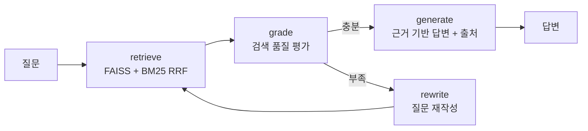
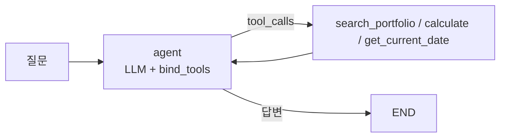
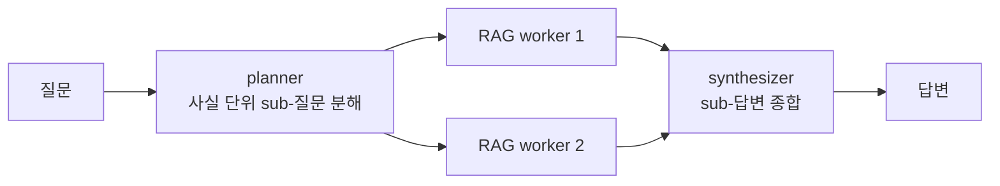
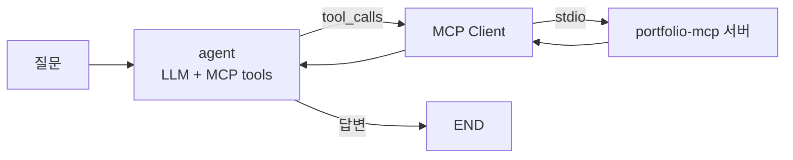

# rag-agent


내 포트폴리오/기술문서를 지식 베이스로 쓰는 로컬 RAG Agent.
LangGraph로 만들었고, 검색 품질을 스스로 평가해서 부족하면 질문을 재작성하는
corrective 루프에, 도구(검색/계산/날짜)를 골라 쓰는 tool-calling 레이어,
멀티홉 질문을 분해 처리하는 multi-agent 오케스트레이션 레이어, 그리고
도구를 MCP 서버에서 가져오는 MCP 클라이언트 레이어를 얹었다.

Ollama + FAISS 조합이라 전부 로컬에서 돌고 외부 API가 필요 없다.

## 구조

```
src/
├── config.py     모델, 청킹, 검색 파라미터
├── inspect_data.py  인덱싱 전 데이터 검수 (길이 분포 + 잔여 노이즈 스캔)
├── vectorstore.py   벡터 저장소 교체 레이어 (FAISS / Qdrant)
├── ingest.py     문서 → 정제 → 청킹 → 임베딩 → 벡터 저장소 + 청크 저장(BM25용)
├── graph.py      Corrective-RAG 그래프 (하이브리드 검색 + self-correction)
├── tools.py      Agent 도구 (검색 / 계산 / 날짜)
├── agent.py      Tool-Calling Agent (ReAct 루프 + 폴백)
├── team.py       Multi-Agent: Planner → RAG Workers → Synthesizer
├── mcp_agent.py  MCP 클라이언트 Agent (portfolio-mcp 서버의 도구 사용)
├── api.py        FastAPI /ask
└── cli.py        대화형 CLI
eval/
├── eval_set.json      평가 질문 10문항 (정답 패턴 포함)
├── evaluate.py        정답률, 재작성률, 지연시간 측정
├── retrieval_set.json 질문별 gold chunk 라벨 (내용 md5로 고정)
├── eval_retrieval.py  검색 단독 recall@k / MRR (LLM 불필요, 수 초)
├── eval_tool_chain.py 도구 체이닝 한계 측정 (모델을 바꿔가며 1→2→3단)
├── compare_stores.py  FAISS vs Qdrant — 결과 일치 확인 + 필터 비교
├── relabel_retrieval.py 청킹이 바뀌었을 때 gold 라벨 재부착 (매칭 점수 출력)
└── rescore.py         저장된 결과를 새 채점 기준으로 재채점
```

### RAG 흐름



검색은 FAISS(의미)와 BM25(키워드)를 RRF로 섞는다. 'Jenkins'나 'Pyannote' 같은
고유명사 질문에서 벡터 검색이 자꾸 엉뚱한 걸 가져와서 넣었는데, 효과가 컸다.
답변은 문서 근거가 없으면 모른다고 하게 프롬프트를 잡았다.

### Tool-Calling 레이어



RAG 검색을 `search_portfolio` 도구로 감싸고, 계산(`calculate`, AST 기반이라 eval 안 씀)과
날짜 조회를 추가했다. "TTFB가 2292ms에서 334ms로 줄었는데 몇 % 개선이야?" 같은
질문이 들어오면 모델이 알아서 검색과 계산을 조합한다.

```bash
python src/agent.py "TTFB가 2292ms에서 334ms로 줄었는데 몇 퍼센트 개선이야?"
# 사용한 도구: ['calculate'] → 약 85.43% 개선
```

### Multi-Agent 레이어 (멀티홉 질문)

단일 RAG는 "A와 B 중 어느 게 먼저야?" 같은 멀티홉 질문에 약하다 —
한 번의 검색으로 서로 다른 두 사실을 모두 가져오기 어렵기 때문이다.



- planner가 질문을 문서에서 찾을 수 있는 사실 단위의 **의문문**으로 분해
  (최대 3개, JSON 파싱 실패 시 원 질문 단일 처리 폴백)
- 각 sub-질문을 기존 Corrective-RAG가 worker로 처리 — planner가 이미
  질의를 정제했으므로 worker의 자체 재작성은 끈다 (이중 가공 방지)
- sub-질문이 1개면 synthesizer 호출을 생략해 불필요한 LLM 호출 제거

```bash
python src/team.py "TTS 프로젝트와 Kubernetes 프로젝트 중 어느 것을 먼저 시작했어?"
# sub-질문: ["TTS 프로젝트는 언제 시작했어?", "Kubernetes 프로젝트는 언제 시작했어?"]
# → "먼저 시작한 것은 Kubernetes 프로젝트입니다. TTS는 2025년 9월, Kubernetes는 2024년 3월부터..."
```

### MCP 클라이언트 레이어

tool-calling 레이어의 도구는 이 저장소 안에 하드코딩되어 있다.
`mcp_agent.py`는 같은 에이전트 구조에서 도구만 MCP로 바꾼 버전이다 —
별도 저장소인 [portfolio-mcp](https://github.com/ckc5800/portfolio-mcp) 서버를
stdio로 띄우고, 서버가 광고하는 도구 4개(프로필/프로젝트/논문/BM25 검색)를
`langchain-mcp-adapters`로 변환해 에이전트에 물린다.



도구 정의가 에이전트 밖(서버)에 있으니, 서버에 도구가 추가되면 에이전트는
코드 수정 없이 그대로 쓴다. MCP 서버(제공자)와 클라이언트(소비자)를
양쪽 다 만들어 본 것이 포인트. 무응답 폴백 등 소형 모델 대응은
agent.py와 동일한 패턴을 쓴다.

```bash
# 형제 디렉토리에 portfolio-mcp 클론 필요 (경로는 PORTFOLIO_MCP_SERVER로 변경)
python src/mcp_agent.py "우수 논문상을 받은 논문 제목이 뭐야?"
# MCP 서버가 광고한 도구: ['portfolio_search', 'portfolio_list_projects',
#                          'portfolio_get_publications', 'portfolio_get_profile']
# 사용한 도구: ['portfolio_get_publications']
# 답변: 이윤선의 우수 논문상을 수상한 논문 제목은 "국방 데이터 확보를 위한
#       생성모델 Latent Diffusion 실험"입니다. ...
```

3B 모델이 폴백 없이 스스로 `portfolio_get_publications`를 골랐다 —
질문 성격에 맞는 도구 선택까지 MCP 도구 스키마만으로 동작한다.

## 실행

```bash
# Ollama 설치 후 (GPU 있으면 config.py에서 7b로 바꾸는 걸 추천)
ollama pull qwen2.5:3b
ollama pull bge-m3

python -m venv .venv && .venv\Scripts\activate
pip install -r requirements.txt

python src/inspect_data.py   # 0단계: 인덱싱할 텍스트를 눈으로 확인 (LLM 불필요)
python src/ingest.py    # 인덱스 구축 (VECTOR_STORE=qdrant 로 저장소 교체 가능)
python src/cli.py       # RAG로 질문
python src/agent.py "질문"      # tool-calling agent로 질문
python src/team.py "질문"       # multi-agent로 멀티홉 질문
python src/mcp_agent.py "질문"  # MCP 도구를 쓰는 agent (portfolio-mcp 필요)
python eval/evaluate.py         # 단일 RAG 평가 (LLM 필요)
python eval/eval_retrieval.py   # 검색 단독 recall@k (LLM 불필요, 수 초)
python eval/evaluate_team.py    # 멀티홉: 단일 RAG vs 팀 비교

# 정제/청킹을 바꾸면 gold 라벨(md5)이 무효화된다 → 재부착
git show HEAD:data/chunks.jsonl > /tmp/old.jsonl
python eval/relabel_retrieval.py --old /tmp/old.jsonl          # 매칭 점수 확인
python eval/relabel_retrieval.py --old /tmp/old.jsonl --write  # 반영
```

## 평가와 삽질 기록

10문항 평가셋으로 정답률 / 재작성률 / 지연시간을 측정한다.
뭔가 바꿀 때마다 돌려서 회귀 여부를 확인하는 용도다.

| | v1 | v2 | v4 | v5* | v6* | v7* |
|---|---|---|---|---|---|---|
| 정답률 | 50% | 60% | 60% | 70% | 70% | **90%** |
| 재작성률 | 100% | 30% | 30% | 30% | 40% | 30% |
| 검색 때문에 틀린 것 | 3건 | 3건 | 1건 | 1건 | 1건 | **0건** |

*v5부터는 더 엄격한 패턴 채점(아래) 기준이라 앞 열과 직접 비교는 안 된다.
3B 모델의 런 간 편차(±10%p)를 감안하면 60→70은 개선이라기보다 같은 수준.
v6는 검색 개선(아래 4번) 후의 런. v7은 데이터 검수(아래) 후의 런.

v7의 90%도 10문항 중 9개라 그 숫자 자체를 자랑할 생각은 없다. 의미 있는 건
**검색 기인 실패가 0건이 됐다**는 쪽이다. 남은 실패 1건은 CI/CD 도구 열거인데,
gold 청크가 **rank 1로 검색됐는데도** 모델이 "GitLab CI/CD와 Jenkins"라고
답해 ArgoCD를 빠뜨렸다 — 검색이 아니라 생성의 문제이고, 검색/생성을 분리해
재기 때문에 그 구분이 지표에서 바로 읽힌다.

수치보다 과정이 재미있었다. 커밋 로그에 다 남아 있다.

1. 첫 평가에서 재작성률이 100%가 나왔다. 프롬프트 문제인 줄 알고 한참 고쳤는데,
   알고 보니 grade 노드가 반환하는 키가 `AgentState`에 정의돼 있지 않아서
   LangGraph가 값을 조용히 버리고 있었다. 판정 결과와 무관하게 매번 재작성으로
   빠진 것. 스키마에 키 하나 추가로 해결.
2. 그 다음에도 재작성이 남아 있었는데, 'yes/no'로 답하라는 프롬프트에 모델이
   '예/아니오'로 답해서 파싱이 실패하고 있었다. 한국어 응답까지 받게 고쳤다.
3. 고유명사 질문('Jenkins', 'Pyannote')은 벡터 검색이 계속 놓쳤다. BM25를 섞은
   하이브리드로 바꾸고 나서 검색 기인 실패가 3건에서 1건으로 줄었다.
4. RRF 중복 제거 키를 청크 앞 100자로 잡았다가, 같은 접두어로 시작하는 청크들이
   합쳐지는 문제를 코드 리뷰에서 발견. 전체 내용 해시로 바꿨다.
5. 시스템 프롬프트를 길게 쓰면 3B 모델의 tool calling이 아예 죽는다는 걸
   실험으로 확인했다. 프롬프트를 최소로 줄이고, 그래도 무응답이면 검색을
   강제 호출하는 폴백을 넣었다.
6. 멀티홉 답변이 같은 코드로 됐다 안 됐다 했다. temperature 0.1의 미세한
   샘플링 차이 때문이었는데, 원인 추적이 불가능해서 먼저 temperature를 0으로
   고정해 재현 가능하게 만든 뒤 통제 실험으로 변수를 하나씩 분리했다.
7. 그렇게 찾은 원인이 두 개였다. 하나는 planner가 정제한 sub-질문을 worker가
   또 재작성해서 검색 믹스를 흐트러뜨리는 것 — 팀 경로에서는 재작성을 껐다.
   다른 하나는 3B 모델이 엄격한 거부 지시와 명사형 질문("~의 시작 기간")
   조합에서 답을 거부하는 것 — 같은 내용을 의문문("언제 시작했어?")으로 물으면
   통과한다. planner가 의문문으로 분해하도록 few-shot을 고치고 거부 지시를
   완화해서 해결했다. "(2025.09~)" 같은 압축 날짜 표기를 기간으로 해석하지
   못하는 문제도 표기법 힌트 한 줄로 풀었다.

남은 오답은 대부분 3B 모델의 답변 편차다. 같은 질문도 돌릴 때마다 결과가
±10%p쯤 흔들린다. 모델을 키우면 나아질 영역.

### 검색과 생성을 분리해서 재기

정답률 하나로는 실패가 검색 탓인지 생성 탓인지 알 수 없었다.
그래서 평가를 둘로 쪼갰다.

**1. 검색 단독 평가** (`eval/eval_retrieval.py`) — 질문별로 정답이 담긴
청크를 라벨링해 두고(`retrieval_set.json`, 청크 내용 md5로 고정),
프로덕션과 같은 hybrid_search가 그걸 top-k에 올리는지만 잰다.
LLM이 없어서 결정적이고, 수 초 만에 끝난다.

<details>
<summary><b>gold 청크를 어떻게 정했나</b> (이 평가에서 가장 판단이 들어간 부분)</summary>

**손으로 붙였다.** 라벨링 스크립트는 없다. 질문 10개에 gold 총 22개,
**질문당 1~4개**다.

질문 하나에 정답 청크가 여러 개인 이유는 **같은 사실이 여러 문서에 중복**되기
때문이다. TTFB 수치는 `portfolio.md`(원본 로그)와 `resume.md`(이력서 요약)
양쪽에 있다. 그래서 "이 청크만 정답"이 아니라 **"gold 중 하나라도 top-k에
오면 성공"**으로 정의했다. 단일 정답 가정을 버린 것이다.

라벨은 **청크 내용의 md5**라서, 청킹을 바꾸면 자동으로 무효화된다. 옛 라벨로
새 인덱스를 채점하는 사고를 구조적으로 막았다(바꾼 뒤엔 `relabel_retrieval.py`
로 다시 붙인다).

**이 방식의 약점 둘과 대응:**

1. **자기 라벨링** — 시스템을 만든 사람이 라벨을 붙였으니 "검색기가 가져온 걸
   정답이라고 표시한 것 아니냐"는 순환 위험이 있다. 그래서 **gold 전부가 실제
   정답 문자열을 담고 있는지 역검증**했다 — TTFB 질문의 gold 4개가 모두
   `2292`와 `334`를 포함한다.

2. **gold가 많으면 우연히 맞기 쉽다** — 그래서 **무작위 기준선을 계산**했다.
   67청크에서 6개를 뽑을 때 질문별 gold 수(1~4개)를 반영하면,
   **무작위 검색기의 기대 recall@6은 19%**다. 현재 시스템은 100%.
   기준선 없는 지표는 혼자서 아무것도 증명하지 못한다.

남는 한계는 **제3자 라벨링이 아니고 10문항**이라는 것이다. 실무라면 쿼리
로그에서 유형별로 뽑고 클릭·구매 같은 약한 라벨을 섞어 규모를 키우는 게 맞다.

</details>

| recall@1 | recall@3 | recall@6 | MRR |
|---:|---:|---:|---:|
| 70% | 90% | 90% | 0.767 |

10문항 중 9개는 gold가 3위 안에 온다. 유일한 MISS가 "근무한 회사들"
질문 — 회사 목록이 모여 있는 청크가 top-6에 아예 못 든다. 이 질문의
실패는 생성이 아니라 검색 문제라는 게 처음으로 분리돼 보였다.

**2. 채점을 엄격하게** (`eval/rescore.py`) — 키워드 포함 채점은
"논문 7편"의 '7'이 다른 숫자에 우연히 들어가도 통과시킨다. 단위까지
요구하는 정규식 패턴(`7\s*편`)에 전부 일치해야 하고, 거부 답변은
무조건 실패로 바꿨다. 저장된 이전 결과를 재채점해 보니 뒤집힌 케이스는
없었다(6/10 유지) — 이번 런의 통과는 진짜였고, 채점만 단단해진 것.

**3. 전체 재평가 (v5)** — 엄격한 채점으로 70%(7/10). 틀린 3건을 분해하면
1건은 검색 실패(회사 목록, 위에서 확인), 2건은 gold가 1위로 검색됐는데도
생성이 놓친 것 — 3B 모델의 답변 편차 영역이다. 실패 원인이
"검색 1 + 생성 2"로 딱 떨어지는 것 자체가 분리 측정의 소득이다.
다음 개선이 각각 어디를 겨냥해야 하는지(회사 목록 질문은 청킹,
나머지는 모델 크기)가 지표에서 바로 읽힌다.

**4. 검색 실패를 고쳤다** — 원인이 두 개였다. 경력 요약이 담긴 About Me
청크가 노션 내보내기의 `$\color{...}$` 장식으로 오염되어 임베딩이 흐려져
있었고, BM25의 공백 토큰화가 '회사들'(질의)과 '회사'(문서)를 다른 토큰으로
취급했다. 인제스트에 마크다운 정제를 넣고 BM25에 한글 문자 bigram
토크나이저를 붙여 재인제스트한 결과:

| | 전 | 후 |
|---|---:|---:|
| recall@1 | 70% | 80% |
| recall@6 | 90% | 100% |
| MRR | 0.767 | 0.875 |

회사 목록 질문은 MISS(top-6 밖)에서 rank 4로 올라왔다. 청크 경계가
바뀌어 gold 라벨은 같은 기준으로 재라벨링했다.

다만 rank 4로는 아직 부족하다 — generate는 lost-in-the-middle 대응으로
**top-3만 쓰기 때문에**(삽질 6번), 검색엔 잡혀도 생성기에는 전달되지
않는다. 실제로 개선 후 전체 재평가(v6)에서도 이 질문은 여전히 거부로
실패했고, 정답률은 70%로 v5와 같았다(실패 구성만 이동: 검색 순위 1건 +
생성 2건 — 논문 편수를 4편으로 잘못 세는 집계 실패와 CI/CD 도구 열거
누락은 3B 편차 영역). recall@6 100%보다 recall@3이 실효 지표라는 것도
이번에 확인한 것. 다음 후보: 경력 요약 전용 청크를 만들어 rank를
끌어올리거나, generate 컨텍스트를 top-4로 늘려 lost-in-the-middle과의
트레이드오프를 재실험.

### 순서를 잘못 밟았다 — 데이터 검수를 뒤늦게 만든 이야기

위의 "임베딩 오염"을 고치고 나서야 이상한 걸 깨달았다. **정제가 파이프라인의
마지막에 들어와 있었다.** 초기 커밋에는 정제 코드가 아예 없었고,
`clean_markdown`은 일주일 뒤 마지막 커밋에 추가됐다. 그것도 검색/생성 분리
평가가 MISS를 짚어준 뒤에야.

변명하자면 "어떤 노이즈가 해로울지 미리 알 수 없다"고 할 수 있다. 그건
절반만 맞다. 내가 놓친 건 노이즈를 **예측**하는 일이 아니라 인덱싱할 텍스트를
**한 번 눈으로 보는** 일이었다. 청크를 몇 개만 출력해 봤으면 5분이면 보였다.

그래서 그 5분을 강제하는 스크립트를 만들었다 (`src/inspect_data.py`).
길이 분포, 가장 짧은 청크, 잔여 노이즈 패턴을 찍는다. 돌려 보니 **이미
고쳤다고 생각한 데이터에 노이즈가 더 남아 있었다**:

| 발견 | 청크 | 글자 | 코퍼스 대비 |
|---|---:|---:|---:|
| 노션 내부 링크(퍼센트 인코딩 경로) | 13 | 4,073자 | **9.4%** |
| HTML 태그 (`<aside>`, ``) | 5 | 674자 | 1.6% |

노션은 내부 페이지 링크를 `[Experience](%EC%9D%B4%EC%9C%A4%EC%84%A0%20...)`
처럼 인코딩된 한글 파일명으로 내보낸다. 링크 **텍스트**는 의미가 있지만
경로는 순수 노이즈인데, 그것만으로 인덱싱 대상의 9.4%를 먹고 있었다.

고치면서 걸린 함정 둘:

1. **외부 URL도 인코딩을 쓴다.** 논문 링크(`...articleTitle=GAN%EC%9D%84+...`)를
   같이 지우면 "깃허브 주소" 같은 질문에 답할 수 없게 된다. 그래서 단순 치환이
   아니라 `http(s)://`로 시작하는 타깃은 보존하도록 함수로 판별한다.
2. **중첩 링크.** `[[A](url)(kisti) ](내부경로)`는 바깥 텍스트에 `]`가 있어
   링크 정규식이 못 잡는다. 짝을 잃고 남은 `](경로)` 조각을 지우는 규칙을 더했다.

또 `'---'`(3자), `'# 이윤선 이력서'`(9자) 같은 조각이 인덱스 자리만 차지하고
있어 `MIN_CHUNK_CHARS = 30` 필터를 넣었다. 전체 글자의 0.2%라 성능에는 영향이
없지만, 평균 청크 길이를 546자로 끌어내려 **분포를 오해하게 만들고 있었다**
(중앙값은 694자였다).

결과 — 청크 79개 → 67개, 중앙값 694 → 711자:

| | 검수 전 | 검수 후 |
|---|---:|---:|
| recall@1 | 80% | **90%** |
| recall@3 | 90% | **100%** |
| recall@6 | 100% | 100% |
| MRR | 0.875 | **0.95** |

recall@1의 10%p는 10문항 중 1문항이라 그 자체로는 통계적 의미가 없다.
의미 있는 건 **"근무한 회사들" 질문이 rank 4 → rank 2로 올라온 것**이다.
`generate`는 lost-in-the-middle 대응으로 top-3만 쓰기 때문에 rank 4는 애초에
생성기에 전달조차 안 됐다. 문턱을 넘은 것이라 성격이 다르다.

실제로 전체 평가(v7)에서 **이 질문이 처음으로 통과했다.** 프로젝트 시작부터
계속 실패하던 유일한 검색 기인 실패였다:

```
PASS  이윤선이 근무한 회사들을 알려주세요.
  → AICESS (2025.04~재직중) / 인피닉 (2022.08~2025.04) /
    이든티앤에스 (2022.04~2022.08) / 큐헷지 (2020.09~2021.09)
```

정답률은 70% → **90%**, 검색 기인 실패는 **1건 → 0건**이 됐다.

마지막으로 두 가지를 구조로 남겼다. `inspect_data.py --strict`를 **CI에 걸어**
정제가 놓친 노이즈가 있으면 빌드가 실패하게 했고(임베딩·LLM이 필요 없어 몇 초면
끝난다), 청킹이 바뀌면 md5 라벨이 무효화되므로 이전 청크와 대조해 gold를 다시
붙이는 `eval/relabel_retrieval.py`를 만들었다. 자동 매칭이 조용히 틀리면 평가가
통째로 거짓이 되므로 **매칭 점수를 전부 출력하고 임계 미만이면 반영을 거부**한다.

한 가지는 일부러 안 고쳤다. mermaid 다이어그램 3청크는 문법(`graph`,
`subgraph`, 화살표)이 노이즈지만 노드 라벨은 실제 기술 키워드다. 지우면
키워드까지 잃는다. 검수기는 이걸 "결함"이 아니라 **"판단 필요"**로 분류해
보고만 하고 통과시킨다 — 검수기의 역할은 후보를 찾아 주는 것이지 대신
판단하는 것이 아니다.

### 도구 체이닝은 어디서 깨지나

`agent.py`는 구조적으로 multi-step(agent → tools → agent)이다. 하지만
"구조가 지원한다"와 "이 모델이 해낸다"는 다르다. 필요한 도구 수를 늘려가며
**각 3회** 재봤다 (`eval/eval_tool_chain.py`, 성공 횟수 · 중앙값):

| 단계 | qwen2.5:3b | qwen2.5:7b |
|---|---|---|
| 1단 계산만 | **3/3** · 13s | **3/3** · 22s |
| 2단 검색→계산 | **0/3** · 72s | **3/3** · 197s |
| 3단 검색→날짜→계산 | **0/3** · 16s | **0/3** · 19s |

2단에서 갈린다. 3B는 검색 결과를 받고 "이제 계산하겠습니다"라고 **말만 하고**
tool call을 안 내서 `tools_condition`이 END로 보낸다 — 버그가 아니라 모델이
주문서 대신 소감문을 낸 것이다. 3단은 둘 다 `get_current_date`만 부르고
입사일 검색을 건너뛴다. 그리고 7B의 2단은 1단보다 **9배 느리다**(22s→197s).

**측정 방법에서 틀렸던 것** — 처음엔 셀당 1회로 재고 결론을 냈다. 다음 1회에서
3B가 성공하길래 "내가 틀렸다"고 철회했는데, 3회씩 재보니 그 1회가 이상치였고
원래 결론이 맞았다. n=1은 양방향으로 위험하다 — 잘못 확신하게도, 맞는 결론을
잘못 철회하게도 만든다.

3단 실패를 **모델 탓으로 단정하지는 않는다.** 도구 설명에 "입사일·재직 기간"이
없고, 질문의 "올해 기준으로"가 날짜 도구를 먼저 부르게 유도하며, 도구 결과 후
"더 필요한가"를 묻는 장치가 없다. 셋 다 내 코드다.

### FAISS와 Qdrant를 둘 다 붙여봤다

"왜 FAISS인가"에 답하려면 다른 걸 써봐야 했다. `VECTOR_STORE` 환경변수로
교체되게 하고(`src/vectorstore.py`), 같은 평가를 양쪽에 돌렸다.
Qdrant는 서버 없이 로컬 경로로 띄우는 임베디드 모드를 썼다.

```bash
VECTOR_STORE=qdrant python src/ingest.py
VECTOR_STORE=qdrant python eval/eval_retrieval.py
python eval/compare_stores.py     # 둘을 나란히 비교
```

**검색 결과는 완전히 같았다.** recall@1 90% / @3 100% / MRR 0.95, 10문항의
순위까지 한 문항도 다르지 않다. 같은 임베딩에 같은 exact 검색이니 당연하고,
**달랐다면 어딘가 틀린 것**이다.

차이는 **메타데이터 필터**에서 나온다. FAISS는 필터를 못 받아 넉넉히 뽑아
파이썬에서 걸러야 하는데, "몇 배로 뽑을지"를 정할 근거가 없다.
`"이윤선이 근무한 회사들"` 질의에 source 필터를 걸어 재봤다:

| 조건 (전체 67청크 중) | 1배(6개) | 2배(12) | 5배(30) | 10배(60) | Qdrant |
|---|---|---|---|---|---|
| `resume.md` (8개) | 1/6 | 4/6 | 6/6 | 6/6 | **6/6** |
| `publications.md` (3개) | 0/3 | 0/3 | 1/3 | 3/3 | **3/3** |
| `patents.md` (1개) | 0/1 | 0/1 | 0/1 | 1/1 | **1/1** |

조건이 좁을수록 FAISS는 거의 전수를 뽑아야 한다. 67청크라 60개를 뽑는 게
가능한 것이고, **코퍼스가 커지면 그 방식이 성립하지 않는다.** Qdrant는 필터를
검색 단계에 넣으므로 배수라는 개념 자체가 없다.

정리하면 — **이 규모에서는 FAISS로 충분하고**(파일 2개, 의존성 하나, 서버 없음),
가격·재고처럼 **선택적인 필터가 필요해지는 순간 Qdrant가 맞다.** 로드는 FAISS가
조금 빨랐고(1.0s vs 2.1s) 검색 속도는 사실상 같았다(0.34s vs 0.36s).

### 멀티홉 비교 평가에서 배운 것

멀티홉 3문항으로 단일 RAG와 팀을 비교했다 (`eval/evaluate_team.py`).
수치보다 실패 패턴이 흥미로웠다.

- 단일 RAG는 사실 수집 단계부터 무너진다 — "TTS는 2022년부터 시작"처럼
  없는 사실을 지어내거나 아예 못 찾는다.
- 팀은 sub-사실 수집은 정확했다 (두 프로젝트의 기간을 모두 정답으로 가져옴).
  하지만 synthesizer 단계에서 3B 모델의 **비교·집계 추론**이 흔들린다 —
  "2024.03과 2025.09 중 무엇이 먼저인가"를 실행에 따라 맞히기도 틀리기도 하고,
  청크에 흩어진 논문 편수를 세는 것도 실패한다.
- 키워드 채점은 이런 '근거는 맞는데 결론이 틀린' 답을 잡지 못한다는 것도
  확인했다 (양쪽 다 false-pass 발생). LLM-judge나 결론 필드 구조화가 필요하다.

정리하면: planner-worker 구조는 **검색·수집 문제를 풀었고**, 남은 병목은
소형 모델의 산술·비교 추론이다. 날짜/수량 비교를 모델에 맡기지 않고
결정적 코드로 처리하거나 모델을 키우면 해결될 영역이다.

## 한계

- BM25의 조사 문제는 문자 bigram 토크나이저로 완화했지만 형태소 분석기
  대비 정밀도는 떨어진다. 회사 목록 질문도 rank 4까지만 올라온다 —
  요약형 질문에 강한 요약 청크를 따로 두는 것이 다음 후보.
- 개발 PC(i7-4790 + RTX 2070)에서 Ollama의 GPU 백엔드(ggml-cuda)가 초기화 중
  크래시(0xC0000005)가 나서 CPU로 추론 중이다. DLL 로드와 드라이버는 정상이고
  백엔드 초기화 단계에서 죽는 것까지 재현해서 확인했다.
  [ollama#16957](https://github.com/ollama/ollama/issues/16957)과 같은 증상.

## 스택

LangGraph / Qwen2.5-3B (Ollama) / BGE-M3 / FAISS + BM25 / FastAPI
