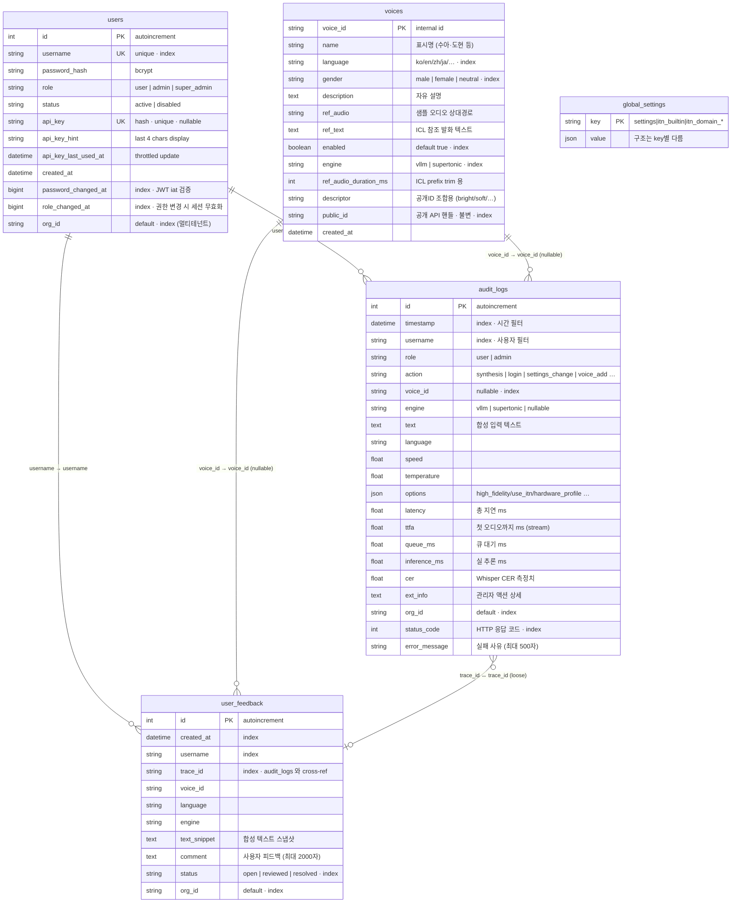

# DB ERD (Entity Relationship Diagram)

- **작성일**: 2026-07-20
- **DB 엔진**: PostgreSQL 16 (Standard/Full 에디션) · SQLite 폴백 (Lite 에디션)
- **ORM**: SQLAlchemy 2.0.41 (async, `Mapped` API)
- **모델 정의**: [`qwen3-tts-api/db/models.py`](../../../qwen3-tts-api/db/models.py)
- **관계 스타일**: **FK 없음 (loose coupling)** — 애플리케이션 레벨 참조 정합만. DB 삭제 시 orphan row 발생 가능 (`AuditLog` 은 감사 목적으로 의도적 보존).

## 스키마 개요 (테이블 5개)

| # | 테이블 | 용도 | PK | 로우 규모 (예상) |
|---|--------|------|-----|----------------|
| 1 | `users` | 계정·인증·API 키 | `id` (auto) | ~수십~수백 |
| 2 | `voices` | 등록된 TTS 화자 메타 (yaml 미러) | `voice_id` (string) | 30~200 |
| 3 | `global_settings` | 시스템 설정 KV (settings/itn_builtin/…) | `key` (string) | ~수십 |
| 4 | `audit_logs` | 합성·관리 이벤트 로그 (**성장 큼**) | `id` (auto) | 일 수천~수만 |
| 5 | `user_feedback` | 합성 결과에 대한 자유 텍스트 피드백 | `id` (auto) | 일 수십 |

## Mermaid ERD 다이어그램

## 관계 상세

**loose FK 관계** (SQL 레벨 FK 제약 없음 · 애플리케이션 참조 정합):

| From | To | 연결 컬럼 | 카디널리티 | 삭제 정책 |
|------|-----|----------|-----------|----------|
| `users` | `audit_logs` | `username` | 1 : N | User 삭제 시 audit 유지 (감사 요구) |
| `users` | `user_feedback` | `username` | 1 : N | User 삭제 시 feedback 유지 |
| `voices` | `audit_logs` | `voice_id` | 1 : N (nullable) | Voice 삭제 시 audit 유지 |
| `voices` | `user_feedback` | `voice_id` | 1 : N (nullable) | Voice 삭제 시 feedback 유지 |
| `audit_logs` | `user_feedback` | `trace_id` | 1 : 0..1 | 피드백 있는 요청만 cross-ref |

**FK 를 안 걸어둔 이유**:
- **감사 요구**: user/voice 삭제 후에도 이력 남겨야 함 (규정 준수). CASCADE 되면 이력 유실.
- **비동기 삭제 유연성**: yaml sync·admin UI 편집이 DB write 와 별도 흐름. FK 있으면 순서 강제로 마찰.
- **성능**: audit_logs 는 write-heavy 테이블. FK 검증 오버헤드 회피.

## 테이블별 상세

### 1. `users` — 계정·인증

**핵심 사용**:
- JWT 발급 (username/password → token)
- API 키 발급/폐기 (`api_key` hash 저장 · `api_key_hint` 로 UI 식별)
- 권한 변경 즉시 무효화: JWT 의 `iat` 를 `password_changed_at` · `role_changed_at` 과 비교

**보안**:
- `password_hash`: bcrypt (`core/security.py`)
- `api_key`: 저장 시 SHA-256 해시 · 원본은 발급 순간만 사용자에게 노출
- `role`: `user` / `admin` / `super_admin` — `role_changed_at` 로 강등 즉시 반영

**인덱스**:
- `username` UK · `api_key` UK · `password_changed_at` · `role_changed_at` · `org_id`

### 2. `voices` — 화자 메타

**핵심 사용**:
- vllm 엔진 ICL 클로닝 참조 (ref_audio + ref_text)
- 공개 API 핸들 (`public_id`) 로 외부 노출 (내부 voice_id 감춤)
- 관리자 UI 에서 CRUD

**yaml 미러**:
- 마스터는 DB · YAML (`data/voices/voices.yaml`) 은 백업/시드
- API 편집 시 자동 dump (memory `voice-metadata-db-master`)

**주요 컬럼**:
- `enabled`: 비활성 화자는 목록·합성에서 제외
- `engine`: `vllm` vs `supertonic` 라우팅 결정
- `ref_audio_duration_ms`: ICL prefix trim (모델이 참조 음성 앞부분 복제하는 경향)
- `descriptor`: 공개 ID 생성 규칙 `{M|F}_{lang}_{descriptor}` (예: `F_ko_bright`)
- `public_id`: 불변 핸들 · 배포 후에도 클라이언트 코드 안전

**인덱스**:
- `language` · `gender` · `enabled` · `engine` · `public_id`

### 3. `global_settings` — 시스템 설정 KV

**핵심 사용**:
- 관리자 UI 저장하는 시스템 파라미터 (batch_concurrency_limit · silence_padding_ms 등)
- ITN 빌트인 사전 (`itn_builtin` · `itn_domain_*`)
- 발음 사전 (`pronunciation_rules`)
- Webhook · 이메일 설정
- 재배포 없이 즉시 반영 (pub/sub 브로드캐스트)

**중요 규약**:
- 실효값 = **DB > env > default** (memory `db-settings-override-env`)
- env 만 수정해도 DB 값 있으면 무시됨
- 튜닝 전 반드시 관리자 API 로 실효값 확인

**주요 key**:
| key | value 구조 | 용도 |
|-----|-----------|------|
| `settings` | `dict` (수십 필드) | 전역 파라미터 |
| `itn_builtin` | `dict` (eng_tech/eng_proper/…) | 내장 ITN 사전 |
| `itn_domain_finance` 등 | `dict` | 도메인별 ITN 사전 |

### 4. `audit_logs` — 이벤트 로그 (**성장 관리 대상**)

**핵심 사용**:
- 합성 요청 이력 (성공·실패·지연 breakdown)
- 관리자 작업 이력 (settings_change · voice_add · user_role_change …)
- 통계·SLA 대시보드 · 사후 분석
- 이상 요청 탐지 (`status_code` 4xx/5xx 필터)

**지연 breakdown** (P3-3):
- `latency`: 총 요청 지연
- `queue_ms`: 세마포어/큐 대기
- `inference_ms`: 실제 GPU 추론
- `ttfa`: 첫 오디오 청크 (stream 전용)
- `cer`: Whisper 정확도 (measure_cer=true 시)

**옵션 필드** (`options` JSON):
- `high_fidelity`, `use_itn`, `use_split`, `use_normalize`, `use_silence_guard`,
  `use_micro_fade`, `smart_prosody`, `hardware_profile`, `itn_domain`, …

**인덱스**:
- `timestamp` · `username` · `voice_id` · `status_code` · `org_id`
- 복합: `(username, timestamp)` · `(action, timestamp)`

**관리**:
- 성장 큼 → 주기적 archive 필요 (별도 policy)
- 통계 라우터가 WHERE 조건으로 DB 필터 (memory `2a855b3 통계 라우터를 DB WHERE 로`)

### 5. `user_feedback` — 자유 텍스트 피드백

**핵심 사용**:
- 합성 결과에 대한 사용자 자유 피드백 수집
- `trace_id` 로 audit_logs 와 cross-reference 가능
- 관리자 처리 워크플로우 (`open` → `reviewed` → `resolved`)

**중요**:
- `comment` 필수 (`nullable=False`)
- 최대 2000자
- `voice_id` · `language` · `engine` 은 nullable (스냅샷 목적, 삭제 후에도 identify)

**최근 커밋** (`ccd817f nightly: 피드백 락 누락 lost-update 3건 수정`) — 동시 write 시 lost update 이슈 fix.

**인덱스**:
- `created_at` · `username` · `trace_id` · `status` · `org_id`
- 복합: `(username, created_at)`

## Redis 캐시·pub/sub (DB 보완)

DB 는 영속 저장 · Redis 는 캐시/브로드캐스트. **Redis 는 스키마 없음** (KV):

| 키 패턴 | 용도 | TTL |
|--------|------|-----|
| `tts:audio:<hash>` | 합성 결과 캐시 (WAV) | 설정 (기본 24h) |
| `tts:reg:<addr>:<voice_id>` | vLLM voice 등록 상태 | 세션 |
| `tts:trace:<trace_id>` | LatencyTracer span 저장 (프론트 폴링용) | 60s |
| `tts:cb:<name>` | Circuit Breaker 상태 | 세션 |
| `tts:sem:*` | Distributed Semaphore | 세션 |
| `config_update` (pub/sub) | 설정 변경 broadcast | — |
| `itn_update` (pub/sub) | ITN 룰 변경 broadcast | — |

pub/sub 이유: 관리자 UI 편집이 즉시 모든 워커에 반영되어야 함. TTL 기반 폴백도 있음 (5초).

## 마이그레이션·초기화

**자동 스키마 생성**:
- 시작 시 `Base.metadata.create_all()` — 테이블 없으면 생성 (SQLAlchemy async)
- 정식 마이그레이션 도구(alembic 등) **없음** — 스키마 변경 시 수동 반영 필요

**첫 실행 시드**:
- `voices.yaml` → `voices` 테이블 (조건부: 테이블 비어있을 때만)
- `itn_builtin.json` → `global_settings("itn_builtin")` (조건부: 키 없을 때만)
- 위 조건부 seed 는 관리자 편집을 덮어쓰지 않기 위함

**스키마 변경 시** (수동 절차 필요 → 개선 여지):
1. `models.py` 수정
2. 스테이징에서 실 DB 대상 ALTER TABLE (수동 SQL)
3. 프로덕션 배포 전 dump/restore 안전판
4. 향후 alembic 도입 검토 (memory 상 개선 과제)

## 백업·복원

`docs/guide/architecture/DB_아키텍처.md` 참조 (기존 문서).

기본 원칙:
- 매일 자동 dump (별도 스크립트 필요 · 프로덕션 배포 시 설정)
- `audit_logs` 는 대량 → 별도 rotate/archive 정책 고려

## 관련 문서

- [`db/models.py`](../../../qwen3-tts-api/db/models.py) — 코드 진실
- [`db/manager.py`](../../../qwen3-tts-api/db/manager.py) — 저장소·캐시·pub/sub
- [`db/repositories/`](../../../qwen3-tts-api/db/repositories/) — 도메인별 CRUD
- [기존 DB 아키텍처 문서](DB_아키텍처.md) — 사이드바 개념 설명
